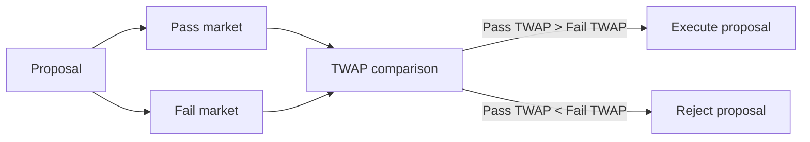

Governance in Areal is built around one core principle: **decisions should be made by markets, not by subjective committees.**

Instead of traditional DAO voting — where participants choose options based on personal preference, incomplete information, or social bias — Areal adopts an economically driven governance model: **futarchy**.

<Info>
  Futarchy is an integral part of Areal's architecture. Every [DAO Ownership Company](/economics/ownership-tokens) uses futarchy as its primary decision-making mechanism — from revenue distribution to asset acquisition to treasury management.
</Info>

---

## The Core Idea

**Futarchy is a governance framework where decisions are evaluated by expected economic outcomes, not by opinions or votes.**

Instead of asking *"What do we want?"*, futarchy asks:

> **"Which action is expected to produce better results?"**

Markets aggregate collective expectations about the future. Governance executes the action that markets predict will create the most value.

---

## Why Traditional Governance Fails

Most governance systems rely on subjective opinions, political influence, narrative persuasion, and short-term incentives. As systems grow more complex, no individual or committee can reliably predict outcomes.

This leads to well-documented failures:

<CardGroup cols={2}>
  <Card title="Poor capital allocation" icon="money-bill-transfer">
    Funds are spent based on who argues loudest, not on what creates value. Treasury raids and misappropriation are common in traditional DAOs.
  </Card>
  <Card title="Governance capture" icon="user-lock">
    Large token holders or insiders dominate voting, directing decisions in their favor rather than the project's long-term interest.
  </Card>
  <Card title="Narrative-driven decisions" icon="bullhorn">
    Proposals win because they sound good, not because they are good. Marketing skill replaces analytical rigor.
  </Card>
  <Card title="Voter apathy" icon="circle-xmark">
    Most token holders don't vote. Decisions are made by a tiny minority, often with misaligned incentives.
  </Card>
</CardGroup>

Futarchy addresses all of these by **pricing expectations instead of counting votes**.

---

## How Decision Markets Work

Futarchy replaces voting with **conditional markets** — two parallel markets that let participants trade on the expected token value under different outcomes.

### The mechanism step by step

<Steps>
  <Step title="Proposal is created">
    Anyone can submit a proposal — spend treasury funds, acquire a new asset, change yield parameters, hire a service provider. The proposal is published on-chain and visible to all token holders.
  </Step>
  <Step title="Two conditional markets open">
    The system creates two markets:

    - **Pass market** — trades the token's expected price if the proposal is approved
    - **Fail market** — trades the token's expected price if the proposal is rejected

    Both markets receive equal initial liquidity.
  </Step>
  <Step title="Traders express their expectations">
    Participants trade in both markets based on their analysis:

    - If you believe the proposal will increase token value, you buy in the pass market
    - If you believe it will decrease value, you sell in the pass market and buy in the fail market
    - Traders are rewarded for correct predictions and penalized for wrong ones
  </Step>
  <Step title="TWAP determines the outcome">
    After the trading period, the system compares time-weighted average prices (TWAPs) of both markets. If the pass market TWAP is higher than the fail market TWAP — the proposal is accepted and executed automatically. Otherwise, it is rejected.
  </Step>
</Steps>

### Why TWAP instead of a single price

A time-weighted average price measured over the trading period prevents manipulation. Single-point prices can be spiked by large orders, but sustaining a manipulated price over time is economically prohibitive — manipulators lose money to informed traders who trade against them.

---

## Why Markets Beat Votes

Markets are fundamentally better decision instruments because they:

- **Aggregate distributed knowledge** — every participant contributes their private information through trading
- **Reward accuracy** — correct predictions earn profits; incorrect ones lose money
- **Penalize misinformation** — spreading false narratives costs real capital when others trade against you
- **Incorporate uncertainty naturally** — prices reflect confidence levels, not binary yes/no choices
- **Resist capture** — buying votes is cheap; sustaining a manipulated market price is expensive

Participants are incentivized to be **correct**, not persuasive. This is a fundamental difference from voting, where incentives favor rhetoric over analysis.

<Note>
  Prediction markets have a proven track record of outperforming expert committees. Markets identified the cause of the 1986 Challenger disaster in 16 minutes — the government investigation took 4 months. Election prediction markets consistently outperform professional pollsters.
</Note>

---

## Why Futarchy Is Essential for RWA

Real-world assets present unique governance challenges that make futarchy not just useful, but necessary:

### Long-term capital demands discipline

RWA projects manage real estate, infrastructure, and intellectual property — assets with long investment horizons. Short-term sentiment-driven voting is dangerous when decisions have multi-year consequences.

### Revenue allocation requires objectivity

[DAO Ownership Companies](/economics/ownership-tokens) generate real revenue — rent, fees, royalties. Deciding how to allocate this revenue (reinvest, distribute, acquire new assets) requires objective evaluation, not politics.

### Treasury protection is critical

In traditional DAOs, treasury raids are common — insiders propose spending that benefits themselves at the expense of holders. Futarchy makes this structurally difficult: any value-destroying proposal will be reflected in lower pass market prices, causing the proposal to fail.

### Accountability through reality

Every futarchy decision creates a measurable prediction: *"This action will increase token value."* After execution, the outcome is observable. Over time, governance quality compounds as participants learn from results.

---

## The Governance Loop

Futarchy creates a closed feedback loop that improves with every decision:

> **proposal → market evaluation → execution → real-world outcome → learning**

Each cycle generates data: which proposals increased value, which decreased it, who predicted correctly. This information makes every subsequent decision better-informed.

Over time, the system becomes increasingly effective at capital allocation — precisely what RWA projects need for long-term sustainability.

---

## Futarchy in Areal's Architecture

Areal is building a futarchy engine purpose-built for RWA projects. It serves as the governance backbone for every [DAO Ownership Company](/economics/ownership-tokens) on the platform:

- **Revenue decisions** — how to allocate yield from real-world assets
- **Asset management** — which assets to acquire, hold, or divest
- **Treasury operations** — budget allocation, service provider hiring, liquidity management
- **Protocol parameters** — fee structures, rebalancing thresholds, risk limits
- **Strategic direction** — long-term roadmap and development priorities

Every decision that affects value flows through the futarchy mechanism — ensuring that governance remains market-driven, transparent, and aligned with token holder interests.

<Card title="DAO Ownership Company" icon="building-columns" href="/economics/ownership-tokens">
  How Areal structures real-world asset ownership with futarchy governance
</Card>

---

## What Futarchy Is Not

To avoid confusion, futarchy is **not**:

- **Direct democracy** — there is no popular vote; markets decide
- **Representative governance** — no elected committees or delegates
- **Speculation** — markets are decision instruments, not entertainment
- **Opinion polling** — prices reflect economic stakes, not costless preferences
- **Political negotiation** — outcomes are determined by data, not compromise

It is a **decision framework** where economic signals replace subjective judgment.

---

## Summary

<CardGroup cols={3}>
  <Card title="Markets over votes" icon="scale-balanced" color="#a56eff">
    Decisions are evaluated by conditional markets that price expected outcomes, not by token holder voting
  </Card>
  <Card title="TWAP finalization" icon="chart-line" color="#a56eff">
    Time-weighted average prices prevent manipulation and ensure robust outcome determination
  </Card>
  <Card title="Built for RWA" icon="building" color="#a56eff">
    Purpose-designed for the unique demands of real-world asset governance — long horizons, real revenue, real accountability
  </Card>
  <Card title="Treasury protection" icon="shield-check" color="#a56eff">
    Value-destroying proposals are reflected in market prices and automatically rejected
  </Card>
  <Card title="Compounding quality" icon="arrow-trend-up" color="#a56eff">
    Each decision cycle generates data that improves subsequent governance quality over time
  </Card>
  <Card title="Core infrastructure" icon="gear" color="#a56eff">
    Integral part of every DAO Ownership Company on Areal — from revenue allocation to strategic direction
  </Card>
</CardGroup>
