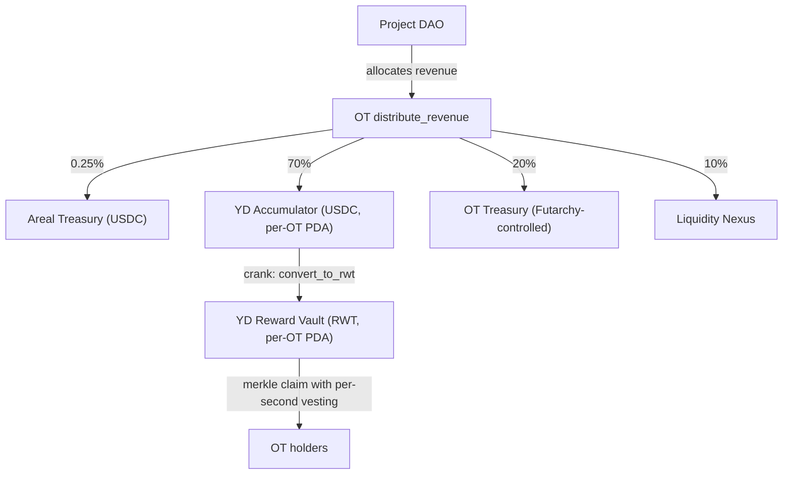

## Core Principle

One of the key architectural elements of the Areal protocol is the **yield and reward distribution mechanism** for [Ownership Token](/economics/ownership-tokens) holders.

The core feature: **you don't need to stake your tokens**. Simply holding Ownership Tokens in your wallet is enough to earn rewards. Areal tracks token balances per fund event and distributes rewards proportionally to each holder's ownership at the time of that event, **vesting per second**.

<Info>
  No staking, no locking, no special contracts. Hold OTs in your wallet → rewards accumulate automatically → claim them at any time in the Portfolio section on [areal.finance](https://areal.finance).
</Info>

---

## How It Works

The distribution process flows through several stages — from the project DAO's decision to the holder's wallet:

<Steps>
  <Step title="DAO decides to distribute">
    The [DAO Ownership Company](/economics/ownership-tokens) of a specific project decides — through [futarchy governance](/architecture/governance-and-futarchy) — to direct a portion of earned revenue to token holders as rewards for holding.
  </Step>
  <Step title="Revenue lands in the OT contract and is split">
    Approved revenue accumulates in the project's RevenueAccount (USDC). Once the cooldown and minimum-balance conditions are met, a permissionless crank calls `ownership_token::distribute_revenue`. The contract first deducts a **0.25% Areal protocol fee** to the [Treasury](/economics/treasury); the remainder is split per the project's configured destinations:

    - **70%** → per-OT YD Accumulator (USDC), the staging account that funds the merkle reward stream for OT holders
    - **20%** → the project's **OT Treasury** (multi-token PDA wallet, governed by Futarchy)
    - **10%** → routed into the **Liquidity Nexus** (USDC lane via a crank-driven `nexus_deposit`)

    Defaults are configurable per project via `batch_update_destinations`; the totals always sum to 100%.
  </Step>
  <Step title="USDC is converted to RWT and funded into the reward vault">
    A permissionless crank calls `yield_distribution::convert_to_rwt` on the per-OT distributor. In a single atomic instruction:

    1. The Accumulator's USDC is swapped into RWT on the Native DEX up to the current NAV price.
    2. Any USDC remaining is minted into RWT through `rwt_engine::mint_rwt` at NAV.
    3. A 0.25% YD protocol fee is deducted in RWT and sent to the Areal Treasury RWT ATA.
    4. The remaining RWT is deposited into the per-OT **reward vault** PDA, and the merkle distributor's vesting state is extended for the new portion.

    Every fund event extends vesting on top of any unclaimed amount — a perpetual, incrementally funded distributor.
  </Step>
  <Step title="Rewards vest per second">
    Each holder's claimable RWT vests linearly over the configured `vesting_period_secs` — default **365 days (1 year)**. New fund events extend the vesting on the unvested remainder; previously vested amounts are locked and remain immediately claimable.
  </Step>
  <Step title="Holders claim anytime — fair-by-construction">
    Holders claim accumulated RWT at any time via a merkle proof. The off-chain publisher uses a **per-deposit snapshot algorithm**: every fund event is allocated only to holders who held OT at the slot of that event, eliminating front-running on announced distributions. Holders below the $100 minimum-protocol-holding threshold are not eligible at that snapshot — their share is reallocated to the ARL OtTreasury leaf as protocol revenue.
  </Step>
</Steps>

All payouts are unified **in RWT**, regardless of which OT project the revenue came from. This unifies the distribution process across all projects, strengthens the RWT economy, and incentivizes Ownership Token projects to participate in the broader Areal ecosystem.

---

## No-Staking Architecture

Traditional DeFi protocols require users to stake tokens in a contract to earn yield. This creates friction:

- Tokens are locked and illiquid
- Users must interact with staking contracts (gas, complexity)
- Composability is reduced — staked tokens can't be used elsewhere

Areal takes a fundamentally different approach:

<CardGroup cols={2}>
  <Card title="Hold to earn" icon="wallet">
    Simply keeping Ownership Tokens in your wallet qualifies you for rewards. No staking transactions, no lock-ups.
  </Card>
  <Card title="Per-event tracking" icon="clock">
    The protocol snapshots holder balances at every fund event, allocating each event proportionally to who held OT at that moment.
  </Card>
  <Card title="Per-second vesting" icon="stopwatch">
    Rewards vest per second over the distribution period — not daily, not weekly. Your claimable amount grows in real time.
  </Card>
  <Card title="Claim anytime" icon="hand-holding-dollar">
    Accumulated rewards from all your Ownership Tokens are aggregated in the Portfolio section on areal.finance, ready to claim at any time.
  </Card>
</CardGroup>

---

## Per-Deposit Snapshot Fairness

A naive distribution that snapshots only at publish time would award anyone holding OT at that moment a share of **all historical fund events** — including events that arrived before they bought OT. This creates a front-running vector around announced distributions.

Areal eliminates this by using **per-deposit snapshots**: at the slot of each fund event (`DistributorFunded` / `StreamConverted`), the publisher captures every OT holder balance. Each fund event is then allocated only to holders captured in that event's snapshot. A late buyer's first share starts from the next fund event after they acquired OT — never retroactively.

The on-chain contract verifies only the merkle proof and bookkeeping invariants — it does not enforce the snapshot algorithm. This means the publisher's algorithm can evolve (per-deposit → time-weighted average balance, for example) without any contract redeploy.

See [Yield Distribution contract](/contracts/yield-distribution) for the full algorithm and publisher infrastructure requirements.

---

## Aggregated Portfolio View

Holders who own multiple Ownership Tokens across different projects see all their rewards aggregated in one place — the **Portfolio** section on [areal.finance](https://areal.finance):

- Total accrued rewards across all OTs
- Per-project breakdown of rewards
- Real-time accrual counter
- One-click claim for all accumulated rewards

---

## Summary

<CardGroup cols={3}>
  <Card title="No staking required" icon="unlock" color="#a56eff">
    Hold OTs in your wallet — rewards vest automatically per second, no locking or contracts needed
  </Card>
  <Card title="DAO-governed distribution" icon="scale-balanced" color="#a56eff">
    Each project DAO decides how much revenue to distribute to holders through futarchy governance
  </Card>
  <Card title="70 / 20 / 10 split" icon="chart-pie" color="#a56eff">
    After the 0.25% Areal fee, project revenue routes 70% to OT-holder rewards, 20% to the project's OT Treasury, 10% to the Liquidity Nexus
  </Card>
  <Card title="USDC → RWT conversion" icon="arrows-rotate" color="#a56eff">
    A crank atomically swaps the holder share into RWT (DEX swap up to NAV + mint the remainder) and deposits it into the reward vault
  </Card>
  <Card title="Per-second vesting" icon="stopwatch" color="#a56eff">
    Rewards vest linearly over the configured distribution period (default 365 days), with new fund events extending the vesting
  </Card>
  <Card title="Front-run-resistant" icon="shield-halved" color="#a56eff">
    Per-deposit snapshots ensure each fund event is allocated only to holders who held OT at that event — late buyers cannot capture historical yield
  </Card>
</CardGroup>
