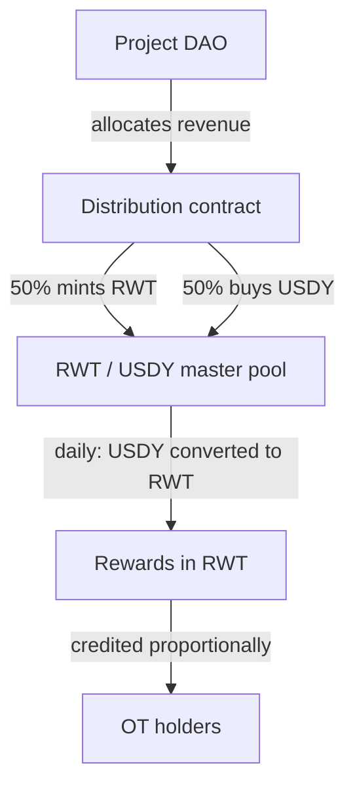

## Core Principle

One of the key architectural elements of the Areal protocol is the **yield and reward distribution mechanism** for [Ownership Token](/economics/ownership-tokens) holders.

The core feature: **you don't need to stake your tokens**. Simply holding Ownership Tokens in your wallet is enough to earn rewards. Areal tracks token balances and distributes rewards proportionally to each holder's current ownership share, **accruing every second**.

<Info>
  No staking, no locking, no special contracts. Hold OTs in your wallet → rewards accumulate automatically → claim them at any time in the Portfolio section on [areal.finance](https://areal.finance).
</Info>

---

## How It Works

The distribution process flows through several stages — from the project DAO's decision to the holder's wallet:

<Steps>
  <Step title="DAO decides to distribute">
    The [DAO Ownership Company](/economics/ownership-tokens) of a specific project decides — through [futarchy governance](/architecture/governance-and-futarchy) — to direct a portion of earned revenue to token holders as rewards for holding.
  </Step>
  <Step title="Funds are sent to the distribution contract">
    The approved funds are transferred to the Areal distribution contract on behalf of the specific project DAO. Areal DAO charges a **0.25% fee** on the distribution amount, directed to the [Treasury](/economics/treasury).
  </Step>
  <Step title="Funds are split and deployed into the master pool">
    The distribution amount is split 50/50:

    - Half is used to mint/purchase RWT
    - Half is used to purchase USDY

    Both sides are deposited into the **RWT / USDY** master liquidity pool for a defined distribution period. The default period is **12 months**.
  </Step>
  <Step title="Position generates additional yield">
    While in the liquidity pool, the position earns additional yield:

    - OT yield auto-compounds into pool reserves via `compound_yield` (increases LP value passively)
    - Value appreciation of USDY and RWT tokens

    Note: LP swap fees (0.25% per trade) are collected separately in a per-pool fee vault — LP holders claim them instantly via `claim_lp_fees`, independent of the distribution cycle.
  </Step>
  <Step title="Daily withdrawal in RWT">
    Each day, a proportional share is withdrawn from the liquidity pool. On withdrawal, the USDY side is converted to RWT at the current market price. The full reward is credited to holders **in RWT** — based on their current OT balance.
  </Step>
</Steps>

All rewards are paid out **in RWT**. This unifies the distribution process across all projects, strengthens the RWT economy, and incentivizes Ownership Token projects to participate in the broader Areal ecosystem.

---

## No-Staking Architecture

Traditional DeFi protocols require users to stake tokens in a contract to earn yield. This creates friction:

- Tokens are locked and illiquid
- Users must interact with staking contracts (gas, complexity)
- Composability is reduced — staked tokens can't be used elsewhere

Areal takes a fundamentally different approach:

<CardGroup cols={2}>
  <Card title="Hold to earn" icon="wallet">
    Simply keeping Ownership Tokens in your wallet qualifies you for rewards. No staking transactions, no lock-ups.
  </Card>
  <Card title="Real-time tracking" icon="clock">
    The protocol tracks every wallet's OT balance continuously, distributing rewards proportionally to current token ownership.
  </Card>
  <Card title="Per-second accrual" icon="stopwatch">
    Rewards are calculated and accrued every second — not daily, not weekly. Your rewards grow in real time.
  </Card>
  <Card title="Claim anytime" icon="hand-holding-dollar">
    Accumulated rewards from all your Ownership Tokens are aggregated in the Portfolio section on areal.finance, ready to claim at any time.
  </Card>
</CardGroup>

---

## Yield Amplification Through Liquidity

A unique feature of the Areal distribution model is that rewards **grow while being distributed**. By deploying funds into the RWT / USDY master pool during the distribution period:

- **Swap fees** from every trade in the pool add to the total reward pool
- **USDY yield** — as a yield-bearing stablecoin, USDY continues to appreciate
- **RWT appreciation** — as NAV Book Value grows, the RWT side of the position increases in value

This means holders receive **more than the original amount** allocated by the DAO — the distribution mechanism itself amplifies the rewards.

---

## Aggregated Portfolio View

Holders who own multiple Ownership Tokens across different projects see all their rewards aggregated in one place — the **Portfolio** section on [areal.finance](https://areal.finance):

- Total accrued rewards across all OTs
- Per-project breakdown of rewards
- Real-time accrual counter
- One-click claim for all accumulated rewards

---

## Summary

<CardGroup cols={3}>
  <Card title="No staking required" icon="unlock" color="#a56eff">
    Hold OTs in your wallet — rewards accrue automatically every second, no locking or contracts needed
  </Card>
  <Card title="DAO-governed distribution" icon="scale-balanced" color="#a56eff">
    Each project DAO decides how much revenue to distribute to holders through futarchy governance
  </Card>
  <Card title="12-month deployment" icon="calendar" color="#a56eff">
    Funds are deployed into the master liquidity pool for 12 months, earning additional yield during distribution
  </Card>
  <Card title="Yield amplification" icon="chart-line" color="#a56eff">
    Rewards grow through swap fees and token appreciation while being distributed over the period
  </Card>
  <Card title="Daily distribution" icon="clock" color="#a56eff">
    A proportional share is withdrawn from the pool and credited to holders every day
  </Card>
  <Card title="Aggregated portfolio" icon="layer-group" color="#a56eff">
    All rewards from all OTs visible and claimable in one place on areal.finance
  </Card>
</CardGroup>
