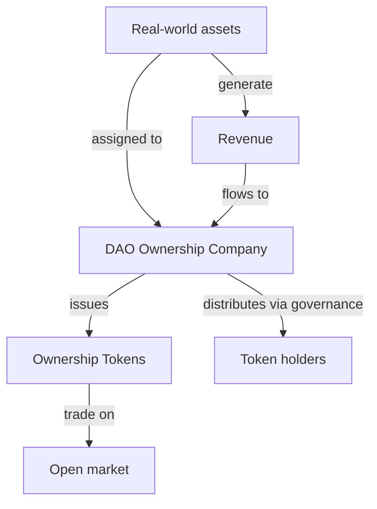

## Core Idea

**Ownership Tokens (OTs) are tokens that represent real, legally enforceable ownership of tangible and intangible assets** within the Areal ecosystem.

Unlike conventional "tokenized assets" that often lack legal backing, each Ownership Token is tied to a **DAO Ownership Company** — a legal entity that officially holds all project assets. This means token holders have a genuine claim on real-world value, not just a speculative digital asset.

<Info>
  Ownership Tokens are issued by individual RWA projects onboarded onto Areal. Each project creates its own DAO Ownership Company, its own token, and manages its own portfolio of assets. OTs trade freely on the market.
</Info>

---

## DAO Ownership Company

At the heart of every Ownership Token is a **DAO Ownership Company** — a legally registered entity (such as a Cayman SPC or equivalent structure) that serves as the official owner of all project assets.

### What is registered to the entity

All assets — both tangible and intangible — are legally assigned to the DAO Ownership Company:

<CardGroup cols={2}>
  <Card title="Tangible assets" icon="building">
    Real estate, equipment, land, vehicles, inventory — any physical assets that generate revenue or hold value
  </Card>
  <Card title="Intangible assets" icon="lightbulb">
    Intellectual property, patents, trademarks, brands, domains, software, social media accounts, licenses
  </Card>
</CardGroup>

### Why a legal entity matters

The DAO Ownership Company bridges the gap between on-chain governance and off-chain legal reality:

- **Legal enforceability** — asset ownership is recognized by courts and jurisdictions, not just by a blockchain
- **Unruggability** — no single founder or team member can extract or misappropriate assets; control belongs to the DAO
- **Regulatory clarity** — a registered entity provides a clear legal framework for revenue distribution, taxation, and compliance
- **IP protection** — intellectual property is formally assigned and protected under law, not merely referenced on-chain

<Note>
  The DAO Ownership Company does not operate autonomously — it is governed by the token holders through [futarchy-based governance](/architecture/governance-and-futarchy), ensuring that all decisions about asset management are market-driven and outcome-oriented.
</Note>

---

## How Ownership Tokens Work

### 1. Project formation

A real-world project registers a DAO Ownership Company and assigns all its assets to this entity. The project then issues Ownership Tokens on Areal, each representing a fractional claim on the company's total asset portfolio.

### 2. Revenue generation

The assets held by the DAO Ownership Company generate real-world revenue:
- **Real estate** — rental income, property appreciation
- **Infrastructure** — service fees, operational revenue
- **Intellectual property** — licensing fees, royalties
- **Financial assets** — interest, dividends

### 3. Revenue distribution

Generated revenue flows to the DAO Ownership Company and is distributed according to decisions made through [futarchy governance](/architecture/governance-and-futarchy). Typical allocations include:
- Yield distribution to token holders
- Reinvestment into existing assets
- Acquisition of new assets
- Operational expenses and reserves

### 4. Market trading

Ownership Tokens trade freely on the market. Their price reflects both the current asset value and future yield expectations. This open market is where the [RWT Vault](/economics/rwt-real-world-token) acquires OTs to build its diversified portfolio.

---

## Governance Through Futarchy

Every DAO Ownership Company is governed through **futarchy** — a market-driven governance framework where decisions are evaluated by their expected economic outcomes rather than by subjective votes.

This means:
- **No committee decides** how revenue is spent — markets evaluate proposals
- **No insider can extract value** — all actions require market approval
- **Capital allocation is optimized** — decisions are backed by economic signals, not politics
- **Accountability is built in** — every decision has measurable outcomes

Futarchy is particularly well-suited for managing real-world assets because it demands disciplined, outcome-oriented governance over long-term capital.

<Card title="Learn more about Futarchy" icon="scale-balanced" href="/architecture/governance-and-futarchy">
  How Areal uses market-driven governance for decision-making
</Card>

---

## DAO as a Sovereign Economic Entity

A DAO Ownership Company is not just a passive holder of assets — it is a **fully autonomous economic entity** capable of making any business decision through governance:

- **Accumulate assets** — acquire new real-world assets, expand the portfolio at its own discretion
- **Deepen liquidity** — grow the liquidity of its own Ownership Token, improving market access for participants
- **Acquire other projects' assets** — purchase Ownership Tokens of other Areal projects, building cross-project exposure
- **Flexible decision-making** — set budgets, hire service providers, fund development, adjust strategy — all through transparent, market-driven governance

The key principle: **complete flexibility with full transparency**. Every action is proposed, evaluated by markets, and executed on-chain — visible to all token holders.

### Infrastructure built by Areal

To make this possible, Areal is building the full infrastructure stack for DAO Ownership Companies:

- **Configurable governance** — flexible roles, permissions, proposal types, and decision-making workflows tailored to each project's needs
- **Futarchy engine** — market-driven evaluation of every proposal through [decision markets](/architecture/governance-and-futarchy), purpose-built for RWA projects
- **Treasury management** — the first priority in development: a system for managing DAO positions, tracking assets, executing trades, and growing the project economy as a whole

<Info>
  [Treasury](/economics/treasury) is the cornerstone of DAO infrastructure — enabling projects to manage capital, deploy assets, and make economic decisions with the precision and transparency that traditional corporate structures cannot match.
</Info>

---

## Summary

<CardGroup cols={3}>
  <Card title="Real ownership" icon="file-contract" color="#a56eff">
    Backed by a legally registered DAO Ownership Company holding tangible and intangible assets
  </Card>
  <Card title="Revenue-generating" icon="money-bill-trend-up" color="#a56eff">
    Assets produce real-world yield — rent, fees, royalties, interest — distributed to holders
  </Card>
  <Card title="Futarchy-governed" icon="scale-balanced" color="#a56eff">
    All decisions are market-driven through futarchy — no committees, no subjective voting
  </Card>
  <Card title="Unruggable" icon="shield-check" color="#a56eff">
    Assets belong to the DAO entity, not founders — control cannot be extracted by insiders
  </Card>
  <Card title="Freely tradeable" icon="arrow-right-arrow-left" color="#a56eff">
    OTs trade on the open market, providing liquidity and transparent price discovery
  </Card>
  <Card title="RWT building blocks" icon="cubes" color="#a56eff">
    The RWT Vault acquires OTs to build a diversified, yield-generating portfolio for RWT holders
  </Card>
</CardGroup>
