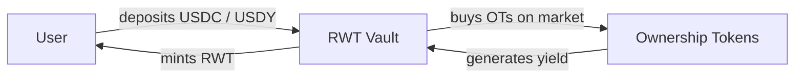

## Core Idea

**RWT is the primary utility token of the Areal protocol** — designed to solve the fundamental problem of fragmented liquidity in the RWA market.

Instead of scattering capital across dozens of isolated pools, Areal aggregates yield from multiple real-world assets into one token. RWT accumulates diversified RWA yield through <Tooltip tip="Ownership Token — a tokenized representation of a specific real-world asset within the Areal protocol">Ownership Tokens</Tooltip> held in its vault, becoming the single point of access to the protocol's entire portfolio.

<Info>
  RWT **does not represent ownership**, **does not grant rights to cash flows**, and **does not create legal or financial obligations**. It is a permissionless utility token that serves as the protocol's unified liquidity and yield aggregation layer.
</Info>

<Card title="What are Ownership Tokens?" icon="key" href="/economics/ownership-tokens">
  Tokenized representations of specific real-world assets within Areal
</Card>

---

## RWT Vault

The **RWT Vault** is the core mechanism that backs RWT with real-world assets. The vault holds a diversified portfolio of <Tooltip tip="Ownership Token — a tokenized representation of a specific real-world asset within the Areal protocol">Ownership Tokens</Tooltip> — and acquires them from the open market using deposited capital.

### How the vault is funded

When users mint RWT, they deposit **USDC** or **USDY** into the vault. The vault then uses this capital to **purchase Ownership Tokens on the market** — selecting assets approved by [governance](/architecture/governance-and-futarchy).

<Note>
  RWA projects issue Ownership Tokens that trade freely on the market. The RWT Vault **purchases** these tokens — projects do not deposit them into the vault directly. This ensures fair market pricing and transparent capital deployment.
</Note>

As more Ownership Tokens are accumulated, the vault's diversification and yield potential grow — without diluting existing RWT holders.

---

## Flatcoin Nature — NAV Book Value

RWT is a **flatcoin** — its price is not pegged to $1, but anchored to a dynamically calculated **NAV Book Value** that grows over time as yield is accumulated.

**NAV Book Value** is calculated as:

> **NAV Book Value = (Initial invested capital + Accumulated yield credited to book value) / Total RWT supply**

### How NAV Book Value grows

The key growth mechanism: **70% of all yield** generated by Ownership Tokens in the vault is credited toward the total invested capital. This means the numerator of the formula increases continuously, even without any new deposits — driving NAV Book Value upward.

**Step-by-step example:**

<Steps>
  <Step title="Starting point">
    $10,000 invested in vault assets, 10,000 RWT in circulation

    **NAV Book Value = $10,000 / 10,000 = $1.00**
  </Step>
  <Step title="Vault earns yield">
    Ownership Tokens in the vault generate $1,000 in yield (rent, interest, revenue)
  </Step>
  <Step title="70% credited to book value">
    70% of $1,000 = $700 is credited to the total invested capital

    NAV Book Value = $10,700 / 10,000 = $1.07
  </Step>
</Steps>

This is what makes RWT a **growing flatcoin** — it doesn't just maintain its value, it steadily appreciates as real-world yield flows into the vault.

### Benefits of NAV-based pricing

<CardGroup cols={2}>
  <Card title="Transparent pricing" icon="eye">
    NAV Book Value is deterministic and verifiable — always based on real vault capital and total supply
  </Card>
  <Card title="No dilution on mint" icon="shield-check">
    New minters pay current NAV Book Value, so existing holders are never diluted
  </Card>
  <Card title="Yield-driven appreciation" icon="chart-line">
    70% of yield continuously grows the price floor — no speculation needed
  </Card>
  <Card title="Self-growing price floor" icon="arrow-trend-up">
    NAV Book Value only moves up as yield accumulates, creating a steadily rising baseline
  </Card>
</CardGroup>

Liquidity in the master pools is always concentrated around NAV Book Value, ensuring that the market price closely tracks the fair value of the underlying assets.

---

## Yield Distribution

Assets held in the RWT Vault generate real-world yield — rent, interest, revenue. This yield is distributed according to a fixed allocation model:

<CardGroup cols={2}>
  <Card title="70% → Book Value Growth" icon="chart-line">
    The majority of yield is reinvested into the vault, directly increasing NAV Book Value and appreciating the price of each RWT.
  </Card>
  <Card title="15% → RWT Liquidity" icon="droplet">
    Allocated to deepen liquidity in the master pools, ensuring efficient trading with minimal slippage.
  </Card>
  <Card title="5% → Areal Treasury" icon="building-columns">
    Directed to the [Areal Treasury](/economics/treasury) for protocol development, operations, and ecosystem growth.
  </Card>
  <Card title="10% → Areal Treasury" icon="shield-check">
    Additional allocation to the [Areal Treasury](/economics/treasury) for protocol safety buffer and ecosystem resilience.
  </Card>
</CardGroup>

---

## Permissionless Minting

Anyone can mint RWT at any time — there are no whitelists, gatekeepers, or approval processes. The minting price is always equal to the **current NAV Book Value**, not a fixed $1 and not the market price.

**Minting price = current NAV Book Value + 1% fee**

A **1% minting fee** is applied on every mint:
- **0.5%** goes to the RWT Vault — directly increasing NAV Book Value for all holders
- **0.5%** goes to [Areal DAO](/economics/treasury) — funding protocol development and operations

For example, if NAV Book Value is $1.50:
- You deposit **151.50 USDC** (150 + 1% fee)
- You receive **100 RWT**
- $0.75 goes to the vault (grows NAV), $0.75 goes to Areal DAO

<Info>
  Permissionless minting creates **zero dilution** — every new minter pays the exact fair value for their share of the vault. Existing holders are never disadvantaged by new mints.
</Info>

---

## Master Liquidity Pools

RWT has two master liquidity pools on Areal's [native DEX](/architecture/liquidity-and-native-dex), providing the primary entry and exit points for the ecosystem:

<CardGroup cols={2}>
  <Card title="RWT / USDY" icon="coins">
    Primary pool paired with **USDY** — a yield-bearing stablecoin by Ondo Finance. This pool allows RWT holders to benefit from stablecoin yield while providing liquidity.
  </Card>
  <Card title="RWT / USDC" icon="dollar-sign">
    Secondary pool paired with **USDC** — the most widely used stablecoin. Provides a straightforward entry point for new participants.
  </Card>
</CardGroup>

Both pools are **concentrated liquidity pools**, with liquidity centered around the current NAV Book Value within a range of **50 bins**. This concentration ensures deep liquidity exactly where trading occurs, maximizing capital efficiency.

---

## Automatic Rebalancing

To keep liquidity aligned with the current fair price, the protocol implements **automatic rebalancing** of master pools.

When the current NAV Book Value deviates from the previous NAV Book Value by more than **1%**, an automatic rebalancing is triggered:

1. Liquidity positions in master pools are withdrawn
2. The new NAV Book Value is calculated based on updated vault asset values
3. Liquidity is redistributed and reformed around the new NAV Book Value
4. The 50-bin concentrated range is re-centered on the updated price

<Note>
  This mechanism ensures that liquidity is **always concentrated around the fair price** of RWT, preventing stale liquidity positions and maintaining efficient markets regardless of how NAV Book Value changes over time.
</Note>

---

## Agentic Management

Areal is designing the RWT Vault architecture with **future autonomous management by AI financial agents** in mind. The goal: a fully autonomous vault that maximizes yield while maintaining diversification and risk control.

Agents will be responsible for:
- **Accumulation strategy** — deciding which Ownership Tokens to include in the vault
- **Yield distribution optimization** — dynamically adjusting allocation parameters
- **Profit extraction timing** — determining optimal moments to realize gains
- **Rebalancing parameters** — fine-tuning concentration ranges and rebalancing thresholds

<Info>
  Agentic management is currently **in development**. Today, these parameters are controlled through [governance](/architecture/governance-and-futarchy). The transition to AI-driven management will be gradual and governed by the community.
</Info>

---

## Summary

<CardGroup cols={3}>
  <Card title="Vault-backed token" icon="vault" color="#a56eff">
    RWT is backed by a diversified vault of Ownership Tokens representing real-world assets
  </Card>
  <Card title="Transparent yield model" icon="chart-mixed" color="#a56eff">
    70% to Book Value growth, 15% to liquidity, 10% to reserves, 5% to treasury
  </Card>
  <Card title="NAV Book Value pricing" icon="calculator" color="#a56eff">
    Price anchored to fair value: total vault assets divided by total RWT supply
  </Card>
  <Card title="Auto-rebalanced liquidity" icon="arrows-rotate" color="#a56eff">
    Master pools automatically rebalance when NAV Book Value shifts by more than 1%
  </Card>
  <Card title="Permissionless minting" icon="unlock" color="#a56eff">
    Anyone can mint RWT at NAV Book Value price — no gatekeepers, no approvals
  </Card>
  <Card title="Agentic-ready" icon="robot" color="#a56eff">
    Vault architecture designed for future autonomous management by AI financial agents
  </Card>
</CardGroup>
