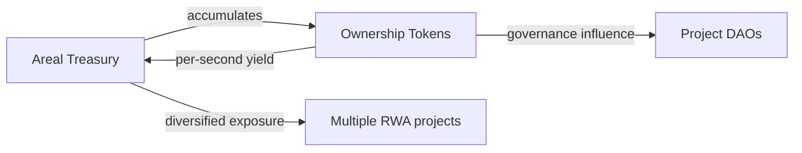

## Core Idea

**Areal DAO Treasury is the actively managed capital of the protocol**, designed to maximize returns for [ARL](/economics/arl-protocol-token) holders.

The Treasury is not a passive vault or a spending account. It is a **strategic growth engine** — accumulating revenue from multiple protocol sources, providing liquidity across the ecosystem, building strategic positions in Ownership Tokens, and generating additional yield from all of these activities.

Every dollar in the Treasury works — earning fees, compounding yield, and strengthening the protocol's economic foundation.

<Info>
  The Treasury is governed by ARL holders through [futarchy](/architecture/governance-and-futarchy). All allocation decisions, strategy changes, and capital deployments are evaluated by expected outcomes — not by committee votes.
</Info>

---

## Revenue Sources

Areal DAO generates revenue from four distinct sources. Together, they create a diversified income base that grows with the ecosystem:

<CardGroup cols={2}>
  <Card title="Native DEX protocol fees" icon="arrow-right-arrow-left">
    **0.25% of every swap** on the [Native DEX](/architecture/liquidity-and-native-dex) flows directly to the Treasury — across all pool types, all pairs. This is 50% of the base 0.5% swap fee, always paid in RWT.
  </Card>
  <Card title="OT Treasury fee" icon="vault">
    **0.5% additional fee** on all OT pair swaps — sent to OT project reserves, controlled by [Futarchy governance](/architecture/governance-and-futarchy). Total OT pair fee: 1%.
  </Card>
  <Card title="RWT Engine" icon="coins">
    Two revenue streams from [RWT](/economics/rwt-real-world-token): **0.5% of every RWT mint** (half of the 1% minting fee) plus **5% of all yield** generated by assets held in the RWT Vault.
  </Card>
  <Card title="Yield distribution contract" icon="chart-line">
    A **0.25% fee** on every [yield distribution](/architecture/yield-and-reward-distribution) processed through the protocol — charged when funds enter the distribution contract.
  </Card>
  <Card title="Nexus LP rewards" icon="droplet">
    LP swap fee rewards from Areal's own liquidity positions — claimed from per-pool fee vaults directly to Treasury via `nexus_claim_rewards`.
  </Card>
  <Card title="Treasury operations" icon="building-columns">
    Returns from active treasury management — yield from held OT tokens, returns on strategic asset positions, and ecosystem growth.
  </Card>
</CardGroup>

These revenue streams are designed to scale with the ecosystem: more projects → more OTs → more trading volume → more minting → more yield distributions → more revenue for the Treasury.

---

## Ownership Token Accumulation

The Treasury strategically accumulates [Ownership Tokens](/economics/ownership-tokens) of projects across the Areal ecosystem. This is not passive holding — it is an active investment strategy with compounding benefits.

The principle is similar to how the [RWT Vault](/economics/rwt-real-world-token) accumulates OTs to back the RWT token. But unlike RWT — which is purely a yield aggregation instrument — ARL holders also own the **protocol's intellectual property**, products, infrastructure, and all economic flows. The Treasury's OT portfolio is just one component of the broader Areal DAO asset base.

Another key difference: ARL trades on the [Native DEX](/architecture/liquidity-and-native-dex) in a **standard curve pool** (constant-product), not a concentrated NAV-anchored pool. This means ARL's market price is determined by open market supply and demand — it may trade above or below the Treasury's book value at any given time.

### Yield generation

As a holder of Ownership Tokens, the Treasury earns yield just like any other holder — through [per-second accrual](/architecture/yield-and-reward-distribution). Revenue generated by project assets (rent, fees, royalties) flows to OT holders proportionally, and the Treasury's positions earn continuously.

### Strategic influence

Holding OTs gives the Treasury voting weight in project-level [futarchy governance](/architecture/governance-and-futarchy). This allows Areal DAO to participate in key decisions of ecosystem projects — aligning their strategies with the broader protocol vision.

### Diversification

By accumulating OTs across multiple RWA projects, the Treasury gains exposure to a diversified portfolio of real-world assets — real estate, infrastructure, intellectual property — reducing concentration risk and stabilizing revenue.

---

## Liquidity Provision — Nexus

Areal DAO is the **primary liquidity provider** on the platform. Treasury capital is managed through the **Liquidity Nexus** — a dedicated smart contract PDA inside the [Native DEX](/contracts/native-dex) that owns LP positions and token accounts on behalf of the protocol.

### How Nexus Works

The Nexus PDA acts as Areal Finance's on-chain LP manager:

- **Capital enters** via `nexus_deposit` — 10% of OT revenue (USDC) and 15% of RWT Engine yield (RWT) are routed through cranks
- **Manager bot** executes LP operations: `nexus_swap`, `nexus_add_liquidity`, `nexus_remove_liquidity`
- **LP fee rewards** are claimed from per-pool fee vaults directly to Areal Treasury via `nexus_claim_rewards`
- **Funds are protected** — the manager bot cannot extract tokens directly, only operate through DEX instructions
- **Manager is replaceable** — DEX authority (Team Multisig) can swap the manager wallet via `update_nexus_manager`

<Warning>
  The Nexus manager bot has **no withdrawal authority**. It can only swap, add, and remove liquidity within the DEX. LP fee rewards are claimed exclusively by the DEX authority (Team Multisig) to the Areal Treasury wallet.
</Warning>

### Key positions

<CardGroup cols={2}>
  <Card title="RWT / USDY master pool" icon="droplet">
    Concentrated liquidity within **50 bins** around NAV Book Value — the primary trading pair for RWT with a yield-bearing stablecoin
  </Card>
  <Card title="RWT / USDC master pool" icon="dollar-sign">
    Concentrated liquidity within **50 bins** — providing an accessible entry point paired with the most widely used stablecoin
  </Card>
  <Card title="RWT / OT pools" icon="link">
    Initial liquidity for project-level pairs using **standard curve** pools — bootstrapping trading for newly listed Ownership Tokens
  </Card>
  <Card title="Strategic pairs" icon="globe">
    Liquidity for third-party token pairs as approved by governance — expanding the DEX's trading universe
  </Card>
</CardGroup>

### What the Treasury earns as LP

- **LP swap fees** — 0.25% of every trade, collected in per-pool fee vaults and claimed instantly via `nexus_claim_rewards`
- **OT yield compound** — pools holding OT tokens receive RWT yield from Yield Distribution, auto-compounded into reserves via `compound_yield` — increasing LP position value passively
- **Yield pass-through** — the underlying yield of tokens held in the pool (RWT appreciation, USDY yield)
- **Ecosystem depth** — deeper liquidity attracts more volume, which generates more fees, creating a self-reinforcing cycle

The Treasury bootstraps liquidity when new pools launch and maintains positions long-term — ensuring the ecosystem always has sufficient depth for efficient trading.

---

## Governance

All Treasury decisions are made through [futarchy governance](/architecture/governance-and-futarchy) by ARL holders. There is no committee, no multisig with discretionary authority — every capital deployment is governed on-chain.

Governance controls:

- **Capital allocation** — how much to deploy into LP positions via Nexus, OT accumulation, or ecosystem development
- **Asset selection** — which Ownership Tokens to accumulate, which pools to provide liquidity for
- **Risk parameters** — concentration limits, rebalancing thresholds, Nexus manager configuration
- **Strategy changes** — adjusting the balance between yield maximization and ecosystem development

Futarchy ensures that decisions are evaluated by their **expected economic outcomes** — poor capital allocation reduces ARL value, strong allocation increases it. This creates built-in accountability for every Treasury action.

---

## Agentic-Ready Infrastructure

Areal is designing the Treasury architecture for **future autonomous management by specialized AI agents**. The goal: maximize Treasury returns through continuous, data-driven optimization that operates faster and more precisely than manual governance.

Specialized agents for Areal's needs:

- **LP optimization** — dynamically adjusting liquidity positions, concentration ranges, and capital allocation across pools based on volume patterns and fee generation
- **OT accumulation strategy** — identifying optimal entry points for Ownership Token purchases, timing acquisitions based on yield expectations and market conditions
- **Profit extraction timing** — determining when to realize gains from LP positions, OT yield, and strategic holdings
- **Portfolio rebalancing** — maintaining target allocations across asset classes, managing concentration risk, and responding to market shifts

<Info>
  Agentic management is currently **in development**. Today, all Treasury parameters are controlled through [futarchy governance](/architecture/governance-and-futarchy). The transition to AI-driven management will be gradual, governed by the community, and focused on measurable performance improvements.
</Info>

---

## Summary

<CardGroup cols={3}>
  <Card title="Profit maximization" icon="chart-line" color="#a56eff">
    The Treasury's primary objective — every decision and allocation is oriented toward maximizing returns for ARL holders
  </Card>
  <Card title="Four revenue streams" icon="money-bill-trend-up" color="#a56eff">
    DEX swap fees, RWT Engine revenue, yield distribution fees, and returns from active treasury operations
  </Card>
  <Card title="OT accumulation" icon="coins" color="#a56eff">
    Strategic Ownership Token positions earn per-second yield, provide governance influence, and diversify the Treasury
  </Card>
  <Card title="Primary LP" icon="droplet" color="#a56eff">
    Areal DAO bootstraps and maintains liquidity across master pools and project pairs, earning fees and deepening markets
  </Card>
  <Card title="Futarchy-governed" icon="scale-balanced" color="#a56eff">
    All decisions — allocation, strategy, risk — are made through market-driven governance with built-in accountability
  </Card>
  <Card title="Agentic-ready" icon="robot" color="#a56eff">
    Treasury architecture designed for future autonomous management by specialized AI agents optimizing returns
  </Card>
</CardGroup>
