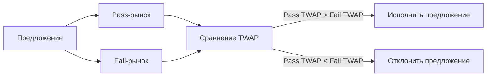

Управление в Areal построено на одном ключевом принципе: **решения должны приниматься рынками, а не субъективными комитетами.**

Вместо традиционного DAO-голосования — где участники выбирают варианты на основе личных предпочтений, неполной информации или социальных предубеждений — Areal применяет экономически обоснованную модель управления: **футархию**.

<Info>
  Футархия — это неотъемлемая часть архитектуры Areal. Каждая [DAO Ownership Company](/ru/economics/ownership-tokens) использует футархию как основной механизм принятия решений — от распределения выручки до приобретения активов и управления казначейством.
</Info>

---

## Ключевая идея

**Футархия — это фреймворк управления, где решения оцениваются по ожидаемым экономическим результатам, а не по мнениям или голосам.**

Вместо того чтобы спрашивать *«Чего мы хотим?»*, футархия спрашивает:

> **«Какое действие, как ожидается, даст лучшие результаты?»**

Рынки агрегируют коллективные ожидания о будущем. Управление исполняет то действие, которое рынки прогнозируют как наиболее ценное.

---

## Почему традиционное управление не работает

Большинство систем управления полагаются на субъективные мнения, политическое влияние, нарративное убеждение и краткосрочные стимулы. По мере усложнения систем ни один человек или комитет не может надёжно предсказать результаты.

Это приводит к хорошо задокументированным провалам:

<CardGroup cols={2}>
  <Card title="Неэффективное распределение капитала" icon="money-bill-transfer">
    Средства тратятся на основании того, кто убедительнее говорит, а не что создаёт ценность. Вывод казначейства и присвоение — обычное дело в традиционных DAO.
  </Card>
  <Card title="Захват управления" icon="user-lock">
    Крупные держатели токенов или инсайдеры доминируют в голосовании, направляя решения в свою пользу, а не в интересах проекта.
  </Card>
  <Card title="Решения на основе нарративов" icon="bullhorn">
    Предложения побеждают, потому что звучат хорошо, а не потому что они хороши. Маркетинговые навыки заменяют аналитическую строгость.
  </Card>
  <Card title="Апатия голосующих" icon="circle-xmark">
    Большинство держателей токенов не голосует. Решения принимаются крошечным меньшинством, часто с несовпадающими стимулами.
  </Card>
</CardGroup>

Футархия решает все эти проблемы, **оценивая ожидания вместо подсчёта голосов**.

---

## Как работают рынки решений

Футархия заменяет голосование **условными рынками** (conditional markets) — двумя параллельными рынками, на которых участники торгуют, оценивая ожидаемую стоимость токена при разных исходах.

### Механизм шаг за шагом

<Steps>
  <Step title="Создаётся предложение">
    Любой может подать предложение — потратить средства казначейства, приобрести новый актив, изменить параметры доходности, нанять поставщика услуг. Предложение публикуется on-chain и видимо для всех держателей токенов.
  </Step>
  <Step title="Открываются два условных рынка">
    Система создаёт два рынка:

    - **Pass-рынок** — торгует ожидаемую цену токена, если предложение будет принято
    - **Fail-рынок** — торгует ожидаемую цену токена, если предложение будет отклонено

    Оба рынка получают равную начальную ликвидность.
  </Step>
  <Step title="Трейдеры выражают свои ожидания">
    Участники торгуют на обоих рынках на основе своего анализа:

    - Если вы считаете, что предложение увеличит стоимость токена — покупаете на pass-рынке
    - Если считаете, что уменьшит — продаёте на pass-рынке и покупаете на fail-рынке
    - Трейдеры вознаграждаются за верные прогнозы и теряют за ошибочные
  </Step>
  <Step title="TWAP определяет результат">
    По завершении торгового периода система сравнивает средневзвешенные по времени цены (TWAP) обоих рынков. Если TWAP pass-рынка выше TWAP fail-рынка — предложение принимается и исполняется автоматически. В противном случае — отклоняется.
  </Step>
</Steps>

### Почему TWAP, а не одномоментная цена

Средневзвешенная по времени цена, измеренная за весь торговый период, предотвращает манипуляции. Одномоментные цены можно резко сдвинуть крупными ордерами, но поддерживать манипулированную цену на протяжении времени экономически убыточно — манипуляторы теряют деньги в пользу информированных трейдеров, торгующих против них.

---

## Почему рынки лучше голосов

Рынки — это фундаментально лучшие инструменты принятия решений, потому что они:

- **Агрегируют распределённые знания** — каждый участник вносит свою приватную информацию через торговлю
- **Вознаграждают точность** — верные прогнозы приносят прибыль, ошибочные — убытки
- **Штрафуют за дезинформацию** — распространение ложных нарративов стоит реального капитала, когда другие торгуют против вас
- **Естественно учитывают неопределённость** — цены отражают уровень уверенности, а не бинарный выбор да/нет
- **Устойчивы к захвату** — покупка голосов дёшева; поддержание манипулированной рыночной цены — дорого

Участники мотивированы быть **правыми**, а не убедительными. Это фундаментальное отличие от голосования, где стимулы благоприятствуют риторике, а не анализу.

<Note>
  Рынки предсказаний имеют доказанный послужной список, превосходящий экспертные комитеты. Рынки определили причину катастрофы Challenger 1986 года за 16 минут — правительственное расследование заняло 4 месяца. Рынки предсказания выборов стабильно превосходят профессиональных социологов.
</Note>

---

## Почему футархия необходима для RWA

Реальные активы создают уникальные управленческие вызовы, которые делают футархию не просто полезной, а необходимой:

### Долгосрочный капитал требует дисциплины

RWA-проекты управляют недвижимостью, инфраструктурой и интеллектуальной собственностью — активами с длинным инвестиционным горизонтом. Управление на основе краткосрочных настроений опасно, когда решения имеют многолетние последствия.

### Распределение выручки требует объективности

[DAO Ownership Companies](/ru/economics/ownership-tokens) генерируют реальную выручку — аренду, сборы, роялти. Решения о том, как распределять эту выручку (реинвестировать, выплатить, приобрести новые активы), требуют объективной оценки, а не политики.

### Защита казначейства критически важна

В традиционных DAO рейды на казначейство — обычное дело: инсайдеры предлагают расходы, выгодные им самим в ущерб держателям. Футархия делает это структурно невозможным: любое предложение, разрушающее ценность, отразится в более низких ценах pass-рынка, и предложение будет отклонено.

### Ответственность через реальность

Каждое решение в футархии создаёт измеримый прогноз: *«Это действие увеличит стоимость токена.»* После исполнения результат наблюдаем. Со временем качество управления нарастает по мере того, как участники учатся на результатах.

---

## Цикл управления

Футархия создаёт замкнутый цикл обратной связи, который улучшается с каждым решением:

> **предложение → рыночная оценка → исполнение → реальный результат → обучение**

Каждый цикл генерирует данные: какие предложения увеличили стоимость, какие снизили, кто прогнозировал верно. Эта информация делает каждое последующее решение более обоснованным.

Со временем система становится всё более эффективной в распределении капитала — именно то, что необходимо RWA-проектам для долгосрочной устойчивости.

---

## Футархия в архитектуре Areal

Areal строит движок футархии, специализированный под RWA-проекты. Он служит управленческим стержнем для каждой [DAO Ownership Company](/ru/economics/ownership-tokens) на платформе:

- **Решения по выручке** — как распределять доходность от реальных активов
- **Управление активами** — какие активы приобретать, удерживать или продавать
- **Операции казначейства** — распределение бюджета, найм поставщиков услуг, управление ликвидностью
- **Параметры протокола** — структура комиссий, пороги ребалансировки, лимиты рисков
- **Стратегическое направление** — долгосрочная дорожная карта и приоритеты развития

Каждое решение, влияющее на стоимость, проходит через механизм футархии — обеспечивая рыночно-ориентированное, прозрачное и согласованное с интересами держателей управление.

<Card title="DAO Ownership Company" icon="building-columns" href="/ru/economics/ownership-tokens">
  Как Areal структурирует владение реальными активами с управлением через футархию
</Card>

---

## Чем футархия не является

Во избежание путаницы, футархия — это **не**:

- **Прямая демократия** — нет народного голосования; решают рынки
- **Представительное управление** — нет избранных комитетов или делегатов
- **Спекуляция** — рынки являются инструментами решений, а не развлечением
- **Опрос мнений** — цены отражают экономические ставки, а не безрисковые предпочтения
- **Политические переговоры** — результаты определяются данными, а не компромиссами

Это **фреймворк принятия решений**, где экономические сигналы заменяют субъективные суждения.

---

## Резюме

<CardGroup cols={3}>
  <Card title="Рынки вместо голосов" icon="scale-balanced" color="#a56eff">
    Решения оцениваются условными рынками, которые прайсят ожидаемые результаты, а не голосованием держателей токенов
  </Card>
  <Card title="Финализация через TWAP" icon="chart-line" color="#a56eff">
    Средневзвешенные по времени цены предотвращают манипуляции и обеспечивают надёжное определение результата
  </Card>
  <Card title="Создано для RWA" icon="building" color="#a56eff">
    Специально спроектировано под уникальные требования управления реальными активами — длинные горизонты, реальная выручка, реальная ответственность
  </Card>
  <Card title="Защита казначейства" icon="shield-check" color="#a56eff">
    Предложения, разрушающие ценность, отражаются в рыночных ценах и автоматически отклоняются
  </Card>
  <Card title="Нарастающее качество" icon="arrow-trend-up" color="#a56eff">
    Каждый цикл принятия решений генерирует данные, которые со временем улучшают качество управления
  </Card>
  <Card title="Ключевая инфраструктура" icon="gear" color="#a56eff">
    Неотъемлемая часть каждой DAO Ownership Company на Areal — от распределения выручки до стратегического направления
  </Card>
</CardGroup>
