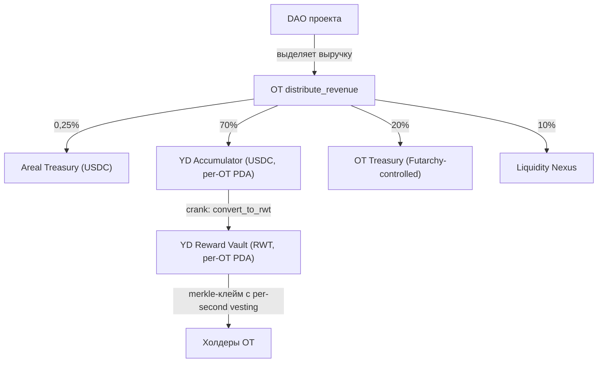

## Ключевой принцип

Один из ключевых архитектурных элементов протокола Areal — это **механизм распределения доходности и наград** для держателей [Ownership Tokens](/ru/economics/ownership-tokens).

Главная особенность: **не нужно стейкать токены**. Достаточно просто держать Ownership Tokens на своём кошельке, чтобы получать награды. Areal трекает балансы токенов на каждом fund-событии и распределяет награды пропорционально доле владения каждого держателя на момент этого события, **вестя per second**.

<Info>
  Никакого стейкинга, блокировок или специальных контрактов. Держите OT на кошельке → награды накапливаются автоматически → забирайте их в любой момент в разделе Портфолио на [areal.finance](https://areal.finance).
</Info>

---

## Как это работает

Процесс распределения проходит через несколько этапов — от решения DAO проекта до кошелька держателя:

<Steps>
  <Step title="DAO принимает решение о распределении">
    [DAO Ownership Company](/ru/economics/ownership-tokens) конкретного проекта решает — через [governance на основе футархии](/ru/architecture/governance-and-futarchy) — направить часть заработанной выручки держателям токенов в качестве наград за удержание.
  </Step>
  <Step title="Выручка приходит в OT-контракт и делится">
    Одобренная выручка накапливается в RevenueAccount проекта (USDC). Когда условия cooldown и минимального баланса выполнены, permissionless crank вызывает `ownership_token::distribute_revenue`. Контракт сначала вычитает **протокольную комиссию Areal 0.25%** в [Казначейство](/ru/economics/treasury); остаток делится по сконфигурированным назначениям проекта:

    - **70%** → per-OT YD Accumulator (USDC), стейджинговый аккаунт, питающий merkle-стрим наград для OT-холдеров
    - **20%** → **OT Treasury** проекта (multi-token PDA-кошелёк, управляемый Futarchy)
    - **10%** → маршрутизируется в **Liquidity Nexus** (USDC-канал через crank-управляемый `nexus_deposit`)

    Дефолты настраиваются на каждый проект через `batch_update_destinations`; сумма всегда равна 100%.
  </Step>
  <Step title="USDC конвертируется в RWT и фондируется в reward vault">
    Permissionless crank вызывает `yield_distribution::convert_to_rwt` на per-OT distributor. В одной атомарной инструкции:

    1. USDC из Accumulator свапается в RWT на Native DEX до текущей NAV-цены.
    2. Оставшийся USDC минтится в RWT через `rwt_engine::mint_rwt` по NAV.
    3. Протокольная комиссия YD 0.25% вычитается в RWT и отправляется в RWT ATA Areal Treasury.
    4. Оставшийся RWT депонируется в per-OT **reward vault** PDA, а состояние вестинга merkle-distributor расширяется на новую долю.

    Каждое fund-событие расширяет вестинг поверх любой не-заклеймленной суммы — perpetual, инкрементально фондируемый distributor.
  </Step>
  <Step title="Награды вестятся per second">
    Claimable RWT каждого холдера вестится линейно по сконфигурированному `vesting_period_secs` — по умолчанию **365 дней (1 год)**. Новые fund-события расширяют вестинг на не-заклеймленный остаток; ранее завестившиеся суммы остаются и доступны для клейма мгновенно.
  </Step>
  <Step title="Холдеры клеймят в любой момент — fair-by-construction">
    Холдеры клеймят накопленный RWT в любой момент через merkle-доказательство. Офф-чейн publisher использует **алгоритм per-deposit snapshot**: каждое fund-событие распределяется только между холдерами, которые держали OT на слоте этого события, устраняя front-running на анонсированных распределениях. Холдеры ниже минимального порога $100 по холдингам протокола не подлежат участию на этом snapshot — их доля перераспределяется в лист ARL OtTreasury как доход протокола.
  </Step>
</Steps>

Все выплаты унифицированы **в RWT**, независимо от того, из какого OT-проекта пришла выручка. Это унифицирует процесс распределения по всем проектам, укрепляет экономику RWT и мотивирует Ownership Token проекты участвовать в более широкой экосистеме Areal.

---

## Архитектура без стейкинга

Традиционные DeFi-протоколы требуют стейкать токены в контракт для получения доходности. Это создаёт трение:

- Токены заблокированы и неликвидны
- Пользователи должны взаимодействовать со стейкинг-контрактами (газ, сложность)
- Композабельность снижается — застейканные токены нельзя использовать в других протоколах

Areal использует принципиально другой подход:

<CardGroup cols={2}>
  <Card title="Держи и зарабатывай" icon="wallet">
    Достаточно просто держать Ownership Tokens на кошельке, чтобы получать награды. Никаких транзакций стейкинга, никаких блокировок.
  </Card>
  <Card title="Per-event трекинг" icon="clock">
    Протокол снимает snapshot балансов холдеров на каждом fund-событии и распределяет каждое событие пропорционально тому, кто держал OT в этот момент.
  </Card>
  <Card title="Per-second вестинг" icon="stopwatch">
    Награды вестятся per second по периоду распределения — не ежедневно, не еженедельно. Ваша claimable-сумма растёт в реальном времени.
  </Card>
  <Card title="Забирайте в любой момент" icon="hand-holding-dollar">
    Накопленные награды от всех ваших Ownership Tokens агрегируются в разделе Портфолио на areal.finance и доступны для вывода в любой момент.
  </Card>
</CardGroup>

---

## Справедливость per-deposit snapshot

Наивное распределение, снимающее snapshot только в момент публикации, наградило бы любого, кто держит OT в этот момент, долей **всех исторических fund-событий** — включая события, поступившие до того, как они купили OT. Это создаёт front-running вектор вокруг анонсированных распределений.

Areal устраняет это через **per-deposit snapshots**: на слоте каждого fund-события (`DistributorFunded` / `StreamConverted`) publisher снимает балансы всех OT-холдеров. Каждое fund-событие затем распределяется только между холдерами, зафиксированными в snapshot этого события. Для позднего покупателя первая доля начинается со следующего fund-события после покупки OT — никогда ретроспективно.

On-chain контракт верифицирует только merkle-доказательство и bookkeeping-инварианты — он не навязывает алгоритм snapshot. Это значит, что алгоритм publisher'а может развиваться (per-deposit → time-weighted average balance, например) без редеплоя контракта.

См. [контракт Yield Distribution](/ru/contracts/yield-distribution) для полного алгоритма и требований к инфраструктуре publisher'а.

---

## Агрегированное портфолио

Держатели, владеющие несколькими Ownership Tokens разных проектов, видят все свои награды в одном месте — в разделе **Портфолио** на [areal.finance](https://areal.finance):

- Общая сумма накопленных наград по всем OT
- Разбивка наград по проектам
- Счётчик начислений в реальном времени
- Вывод всех накопленных наград одним кликом

---

## Резюме

<CardGroup cols={3}>
  <Card title="Без стейкинга" icon="unlock" color="#a56eff">
    Держите OT на кошельке — награды вестятся автоматически per second, без блокировок и контрактов
  </Card>
  <Card title="Распределение через DAO" icon="scale-balanced" color="#a56eff">
    Каждое DAO проекта решает, какую часть выручки распределять держателям через governance на основе футархии
  </Card>
  <Card title="Дележ 70 / 20 / 10" icon="chart-pie" color="#a56eff">
    После 0,25% Areal-комиссии, выручка проекта направляется: 70% — на награды OT-холдерам, 20% — в OT Treasury проекта, 10% — в Liquidity Nexus
  </Card>
  <Card title="USDC → RWT конвертация" icon="arrows-rotate" color="#a56eff">
    Crank атомарно свапает долю холдеров в RWT (DEX swap до NAV + mint остатка) и депонирует в reward vault
  </Card>
  <Card title="Per-second вестинг" icon="stopwatch" color="#a56eff">
    Награды вестятся линейно по сконфигурированному периоду распределения (по умолчанию 365 дней), новые fund-события расширяют вестинг
  </Card>
  <Card title="Защита от front-run" icon="shield-halved" color="#a56eff">
    Per-deposit snapshots обеспечивают, что каждое fund-событие распределяется только между холдерами, которые держали OT на этом событии — поздние покупатели не могут захватить историческую доходность
  </Card>
</CardGroup>
