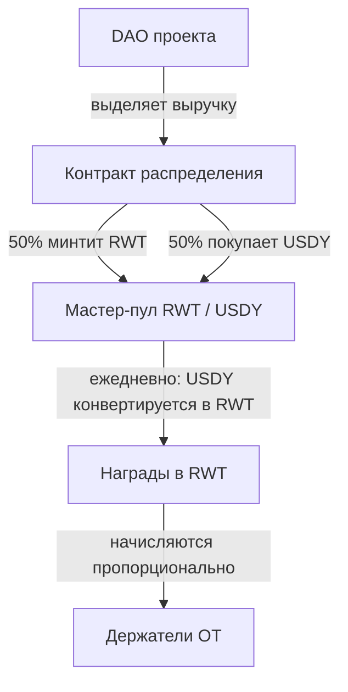

## Ключевой принцип

Один из ключевых архитектурных элементов протокола Areal — это **механизм распределения доходности и наград** для держателей [Ownership Tokens](/ru/economics/ownership-tokens).

Главная особенность: **не нужно стейкать токены**. Достаточно просто держать Ownership Tokens на своём кошельке, чтобы получать награды. Areal трекает балансы токенов и распределяет награды пропорционально текущей доле владения каждого держателя, **начисляя каждую секунду**.

<Info>
  Никакого стейкинга, блокировок или специальных контрактов. Держите OT на кошельке → награды накапливаются автоматически → забирайте их в любой момент в разделе Портфолио на [areal.finance](https://areal.finance).
</Info>

---

## Как это работает

Процесс распределения проходит через несколько этапов — от решения DAO проекта до кошелька держателя:

<Steps>
  <Step title="DAO принимает решение о распределении">
    [DAO Ownership Company](/ru/economics/ownership-tokens) конкретного проекта решает — через [governance на основе футархии](/ru/architecture/governance-and-futarchy) — направить часть заработанной выручки держателям токенов в качестве наград за удержание.
  </Step>
  <Step title="Средства отправляются на контракт распределения">
    Одобренные средства переводятся на контракт распределения Areal от лица конкретного DAO проекта. Areal DAO взимает **комиссию 0.25%** от суммы распределения, направляемую в [Казначейство](/ru/economics/treasury).
  </Step>
  <Step title="Средства делятся и размещаются в мастер-пуле">
    Сумма распределения делится 50/50:

    - Половина идёт на минт/покупку RWT
    - Половина идёт на покупку USDY

    Обе стороны депонируются в мастер-пул ликвидности **RWT / USDY** на определённый срок распределения. Базовый период составляет **12 месяцев**.
  </Step>
  <Step title="Позиция генерирует дополнительную доходность">
    Находясь в пуле ликвидности, позиция зарабатывает дополнительную доходность:

    - Доходность OT автоматически компаундится в резервы пула через `compound_yield` (пассивно увеличивает стоимость LP-позиции)
    - Рост стоимости токенов USDY и RWT

    Примечание: LP swap-комиссии (0.25% за сделку) собираются отдельно в fee vault для каждого пула — LP-держатели выводят их мгновенно через `claim_lp_fees`, независимо от цикла распределения.
  </Step>
  <Step title="Ежедневный вывод в RWT">
    Каждый день пропорциональная часть выводится из пула ликвидности. При выводе сторона USDY конвертируется в RWT по текущей рыночной цене. Полная награда зачисляется держателям **в RWT** — на основе их текущего баланса OT.
  </Step>
</Steps>

Все награды выплачиваются **в RWT**. Это унифицирует процесс распределения по всем проектам, укрепляет экономику RWT и мотивирует Ownership Token проекты участвовать в более широкой экосистеме Areal.

---

## Архитектура без стейкинга

Традиционные DeFi-протоколы требуют стейкать токены в контракт для получения доходности. Это создаёт трение:

- Токены заблокированы и неликвидны
- Пользователи должны взаимодействовать со стейкинг-контрактами (газ, сложность)
- Композабельность снижается — застейканные токены нельзя использовать в других протоколах

Areal использует принципиально другой подход:

<CardGroup cols={2}>
  <Card title="Держи и зарабатывай" icon="wallet">
    Достаточно просто держать Ownership Tokens на кошельке, чтобы получать награды. Никаких транзакций стейкинга, никаких блокировок.
  </Card>
  <Card title="Трекинг в реальном времени" icon="clock">
    Протокол непрерывно отслеживает баланс OT на каждом кошельке, распределяя награды пропорционально текущему владению токенами.
  </Card>
  <Card title="Начисление каждую секунду" icon="stopwatch">
    Награды рассчитываются и начисляются каждую секунду — не ежедневно, не еженедельно. Ваши награды растут в реальном времени.
  </Card>
  <Card title="Забирайте в любой момент" icon="hand-holding-dollar">
    Накопленные награды от всех ваших Ownership Tokens агрегируются в разделе Портфолио на areal.finance и доступны для вывода в любой момент.
  </Card>
</CardGroup>

---

## Усиление доходности через ликвидность

Уникальная особенность модели распределения Areal — награды **растут в процессе распределения**. Размещение средств в мастер-пуле RWT / USDY на период распределения обеспечивает:

- **Комиссии со свопов** — каждая сделка в пуле добавляет к общему пулу наград
- **Доходность USDY** — как yield-bearing стейблкоин, USDY продолжает расти в цене
- **Рост RWT** — по мере роста NAV Book Value сторона RWT в позиции увеличивается в стоимости

Это означает, что держатели получают **больше, чем изначально выделенная сумма** — сам механизм распределения усиливает награды.

---

## Агрегированное портфолио

Держатели, владеющие несколькими Ownership Tokens разных проектов, видят все свои награды в одном месте — в разделе **Портфолио** на [areal.finance](https://areal.finance):

- Общая сумма накопленных наград по всем OT
- Разбивка наград по проектам
- Счётчик начислений в реальном времени
- Вывод всех накопленных наград одним кликом

---

## Резюме

<CardGroup cols={3}>
  <Card title="Без стейкинга" icon="unlock" color="#a56eff">
    Держите OT на кошельке — награды начисляются автоматически каждую секунду, без блокировок и контрактов
  </Card>
  <Card title="Распределение через DAO" icon="scale-balanced" color="#a56eff">
    Каждое DAO проекта решает, какую часть выручки распределять держателям через governance на основе футархии
  </Card>
  <Card title="Размещение на 12 месяцев" icon="calendar" color="#a56eff">
    Средства размещаются в мастер-пуле ликвидности на 12 месяцев, зарабатывая дополнительную доходность
  </Card>
  <Card title="Усиление доходности" icon="chart-line" color="#a56eff">
    Награды растут за счёт комиссий со свопов и роста стоимости токенов в процессе распределения
  </Card>
  <Card title="Ежедневное распределение" icon="clock" color="#a56eff">
    Пропорциональная часть выводится из пула и зачисляется держателям каждый день
  </Card>
  <Card title="Агрегированное портфолио" icon="layer-group" color="#a56eff">
    Все награды от всех OT видны и доступны для вывода в одном месте на areal.finance
  </Card>
</CardGroup>
