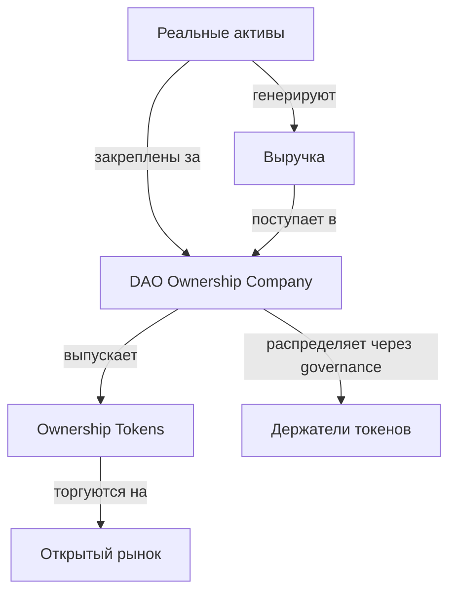

## Ключевая идея

**Ownership Tokens (OT) — это токены, представляющие реальное, юридически закреплённое право собственности на материальные и нематериальные активы** в экосистеме Areal.

В отличие от типичных «токенизированных активов», которые зачастую не имеют юридической базы, каждый Ownership Token привязан к **DAO Ownership Company** — юридическому лицу, которое официально владеет всеми активами проекта. Это означает, что держатели токенов имеют реальное право на стоимость реальных активов, а не просто спекулятивный цифровой актив.

<Info>
  Ownership Tokens выпускаются отдельными RWA-проектами, подключёнными к Areal. Каждый проект создаёт свою DAO Ownership Company, свой токен и управляет собственным портфелем активов. OT свободно торгуются на рынке.
</Info>

---

## DAO Ownership Company

В основе каждого Ownership Token лежит **DAO Ownership Company** — юридически зарегистрированная компания (например, Cayman SPC или аналогичная структура), которая является официальным владельцем всех активов проекта.

### Что регистрируется на компанию

Все активы — как материальные, так и нематериальные — юридически закрепляются за DAO Ownership Company:

<CardGroup cols={2}>
  <Card title="Материальные активы" icon="building">
    Недвижимость, оборудование, земля, транспорт, инвентарь — любые физические активы, генерирующие доход или имеющие стоимость
  </Card>
  <Card title="Нематериальные активы" icon="lightbulb">
    Интеллектуальная собственность, патенты, товарные знаки, бренды, домены, программное обеспечение, аккаунты в соцсетях, лицензии
  </Card>
</CardGroup>

### Зачем нужно юридическое лицо

DAO Ownership Company связывает on-chain-управление с off-chain юридической реальностью:

- **Юридическая сила** — право собственности признаётся судами и юрисдикциями, а не только блокчейном
- **Защита от вывода средств** — ни один основатель или участник команды не может вывести или присвоить активы; контроль принадлежит DAO
- **Регуляторная ясность** — зарегистрированная компания обеспечивает чёткую правовую основу для распределения доходов, налогообложения и комплаенса
- **Защита IP** — интеллектуальная собственность формально закреплена и защищена законом, а не просто указана on-chain

<Note>
  DAO Ownership Company не действует автономно — она управляется держателями токенов через [governance на основе футархии](/ru/architecture/governance-and-futarchy), что обеспечивает рыночно-ориентированное и результативное принятие решений.
</Note>

---

## Как работают Ownership Tokens

### 1. Формирование проекта

Реальный проект регистрирует DAO Ownership Company и закрепляет все свои активы за этой компанией. Затем проект выпускает Ownership Tokens на Areal — каждый токен представляет дробную долю в общем портфеле активов компании.

### 2. Генерация выручки

Активы, принадлежащие DAO Ownership Company, генерируют реальную выручку:
- **Недвижимость** — арендный доход, рост стоимости
- **Инфраструктура** — сервисные сборы, операционная выручка
- **Интеллектуальная собственность** — лицензионные платежи, роялти
- **Финансовые активы** — проценты, дивиденды

### 3. Распределение выручки

Сгенерированная выручка поступает в DAO Ownership Company и распределяется согласно решениям, принятым через [governance на основе футархии](/ru/architecture/governance-and-futarchy). Типичные направления аллокации:
- Распределение доходности держателям токенов
- Реинвестирование в существующие активы
- Приобретение новых активов
- Операционные расходы и резервы

### 4. Торговля на рынке

Ownership Tokens свободно торгуются на рынке. Их цена отражает как текущую стоимость активов, так и ожидания будущей доходности. Именно на этом открытом рынке [RWT Vault](/ru/economics/rwt-real-world-token) приобретает OT для формирования диверсифицированного портфеля.

---

## Управление через футархию

Каждая DAO Ownership Company управляется через **футархию** — рыночно-ориентированную систему управления, в которой решения оцениваются по ожидаемым экономическим результатам, а не по субъективному голосованию.

Это означает:
- **Никакой комитет не решает**, как тратить выручку — рынки оценивают предложения
- **Никто из инсайдеров не может вывести стоимость** — все действия требуют рыночного одобрения
- **Аллокация капитала оптимизирована** — решения подкреплены экономическими сигналами, а не политикой
- **Ответственность встроена** — каждое решение имеет измеримые результаты

Футархия особенно подходит для управления реальными активами, поскольку требует дисциплинированного, ориентированного на результат управления долгосрочным капиталом.

<Card title="Подробнее о футархии" icon="scale-balanced" href="/ru/architecture/governance-and-futarchy">
  Как Areal использует рыночно-ориентированное управление для принятия решений
</Card>

---

## DAO как суверенная экономическая единица

DAO Ownership Company — это не просто пассивный держатель активов, а **полностью автономная экономическая единица**, способная принимать любые бизнес-решения через governance:

- **Накапливать активы** — приобретать новые реальные активы, расширять портфель по собственному усмотрению
- **Углублять ликвидность** — наращивать ликвидность собственного Ownership Token, улучшая доступ к рынку для участников
- **Приобретать активы других проектов** — покупать Ownership Tokens других проектов Areal, формируя кросс-проектную экспозицию
- **Гибкое принятие решений** — устанавливать бюджеты, нанимать поставщиков услуг, финансировать разработку, корректировать стратегию — всё через прозрачное, рыночно-ориентированное управление

Ключевой принцип: **полная гибкость при полной прозрачности**. Каждое действие предлагается, оценивается рынками и исполняется on-chain — видимо для всех держателей токенов.

### Инфраструктура, создаваемая Areal

Чтобы это стало возможным, Areal строит полный стек инфраструктуры для DAO Ownership Companies:

- **Настраиваемое управление** — гибкие роли, разрешения, типы предложений и воркфлоу принятия решений, адаптированные под нужды каждого проекта
- **Движок футархии** — рыночная оценка каждого предложения через [рынки решений](/ru/architecture/governance-and-futarchy), специализированный под RWA-проекты
- **Управление казначейством** — первый приоритет в разработке: система для управления позициями DAO, отслеживания активов, исполнения сделок и развития экономики проекта в целом

<Info>
  [Казначейство](/ru/economics/treasury) — это краеугольный камень инфраструктуры DAO, позволяющий проектам управлять капиталом, размещать активы и принимать экономические решения с точностью и прозрачностью, недоступными традиционным корпоративным структурам.
</Info>

---

## Резюме

<CardGroup cols={3}>
  <Card title="Реальное владение" icon="file-contract" color="#a56eff">
    Обеспечено юридически зарегистрированной DAO Ownership Company, владеющей материальными и нематериальными активами
  </Card>
  <Card title="Генерация дохода" icon="money-bill-trend-up" color="#a56eff">
    Активы производят реальную доходность — аренда, сборы, роялти, проценты — распределяемую держателям
  </Card>
  <Card title="Управление через футархию" icon="scale-balanced" color="#a56eff">
    Все решения рыночно-ориентированы через футархию — без комитетов, без субъективного голосования
  </Card>
  <Card title="Защита от вывода" icon="shield-check" color="#a56eff">
    Активы принадлежат DAO-компании, а не основателям — контроль не может быть захвачен инсайдерами
  </Card>
  <Card title="Свободная торговля" icon="arrow-right-arrow-left" color="#a56eff">
    OT торгуются на открытом рынке, обеспечивая ликвидность и прозрачное ценообразование
  </Card>
  <Card title="Строительные блоки RWT" icon="cubes" color="#a56eff">
    RWT Vault покупает OT для формирования диверсифицированного, доходного портфеля для держателей RWT
  </Card>
</CardGroup>
