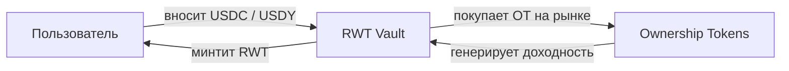

## Ключевая идея

**RWT — это основной утилитарный токен протокола Areal**, созданный для решения фундаментальной проблемы фрагментированной ликвидности на рынке RWA.

Вместо распределения капитала по десяткам изолированных пулов, Areal агрегирует доходность от множества реальных активов в одном токене. RWT накапливает диверсифицированную RWA-доходность через <Tooltip tip="Ownership Token — токенизированное представление конкретного реального актива в протоколе Areal">Ownership Tokens</Tooltip>, хранящиеся в его хранилище (vault), становясь единой точкой доступа ко всему портфелю протокола.

<Info>
  RWT **не представляет собой владение**, **не даёт прав на денежные потоки** и **не создаёт юридических или финансовых обязательств**. Это permissionless utility-токен, который служит единым слоем ликвидности и агрегации доходности протокола.
</Info>

<Card title="Что такое Ownership Tokens?" icon="key" href="/ru/economics/ownership-tokens">
  Токенизированные представления конкретных реальных активов в Areal
</Card>

---

## RWT Vault

**RWT Vault** — это ключевой механизм, который обеспечивает RWT реальными активами. Vault содержит диверсифицированный портфель <Tooltip tip="Ownership Token — токенизированное представление конкретного реального актива в протоколе Areal">Ownership Tokens</Tooltip> — и приобретает их на открытом рынке за счёт внесённого капитала.

### Как наполняется vault

Когда пользователи минтят RWT, они вносят **USDC** или **USDY** в vault. Vault затем использует этот капитал для **покупки Ownership Tokens на рынке** — выбирая активы, одобренные [governance](/ru/architecture/governance-and-futarchy).

<Note>
  RWA-проекты выпускают Ownership Tokens, которые свободно торгуются на рынке. RWT Vault **покупает** эти токены — проекты не депонируют их в vault напрямую. Это обеспечивает справедливое рыночное ценообразование и прозрачное размещение капитала.
</Note>

По мере накопления Ownership Tokens растёт диверсификация и потенциал доходности vault — без размывания существующих держателей RWT.

---

## Природа flatcoin — NAV Book Value

RWT — это **flatcoin**: его цена не привязана к $1, а привязана к динамически рассчитываемому **NAV Book Value**, который растёт со временем по мере накопления доходности.

**NAV Book Value** рассчитывается как:

> **NAV Book Value = (Начальный инвестированный капитал + Накопленная доходность, зачисленная в book value) / Общее количество RWT в обращении**

### Как растёт NAV Book Value

Ключевой механизм роста: **70% всей доходности**, генерируемой Ownership Tokens в vault, зачисляется в общий инвестированный капитал. Это означает, что числитель формулы непрерывно увеличивается даже без новых депозитов — толкая NAV Book Value вверх.

**Пошаговый пример:**

<Steps>
  <Step title="Стартовая точка">
    $10,000 вложено в активы vault, 10,000 RWT в обращении

    **NAV Book Value = $10,000 / 10,000 = $1.00**
  </Step>
  <Step title="Vault зарабатывает доходность">
    Ownership Tokens в vault генерируют $1,000 доходности (аренда, проценты, выручка)
  </Step>
  <Step title="70% зачисляется в book value">
    70% от $1,000 = $700 зачисляется в общий инвестированный капитал

    NAV Book Value = $10,700 / 10,000 = $1.07
  </Step>
</Steps>

Именно это делает RWT **растущим flatcoin** — он не просто сохраняет стоимость, а стабильно дорожает по мере поступления реальной доходности в vault.

### Преимущества ценообразования на базе NAV

<CardGroup cols={2}>
  <Card title="Прозрачное ценообразование" icon="eye">
    NAV Book Value детерминирован и верифицируем — всегда основан на реальном капитале vault и общем предложении
  </Card>
  <Card title="Без разводнения при минтинге" icon="shield-check">
    Новые минтеры платят текущий NAV Book Value, поэтому существующие держатели никогда не размываются
  </Card>
  <Card title="Рост через доходность" icon="chart-line">
    70% доходности непрерывно повышает ценовой пол — спекуляции не нужны
  </Card>
  <Card title="Самовозрастающий ценовой пол" icon="arrow-trend-up">
    NAV Book Value растёт по мере накопления доходности, создавая стабильно повышающуюся базовую цену
  </Card>
</CardGroup>

Ликвидность в мастер-пулах всегда сконцентрирована вокруг NAV Book Value, обеспечивая точное отслеживание рыночной ценой справедливой стоимости базовых активов.

---

## Распределение доходности

Активы в RWT Vault генерируют реальную доходность — аренда, проценты, выручка. Эта доходность распределяется по фиксированной модели аллокации:

<CardGroup cols={3}>
  <Card title="70% → Рост Book Value" icon="chart-line">
    Основная часть доходности остаётся в vault, напрямую увеличивая NAV Book Value и повышая цену каждого RWT.
  </Card>
  <Card title="15% → Казначейство ARL" icon="building-columns">
    Направляется в [Казначейство Areal](/ru/economics/treasury) на развитие протокола, операционные расходы и рост экосистемы.
  </Card>
  <Card title="15% → Liquidity Nexus" icon="droplet">
    Направляется на углубление ликвидности в мастер-пулах, обеспечивая эффективную торговлю с минимальным проскальзыванием.
  </Card>
</CardGroup>

---

## Permissionless Minting

Любой может выпустить (mint) RWT в любой момент — без вайтлистов, гейткиперов или процедур одобрения. Цена минтинга всегда равна **текущему NAV Book Value**, а не фиксированному $1 и не рыночной цене.

**Цена минтинга = текущий NAV Book Value + 1% комиссия**

При каждом минте взимается **комиссия 1%**:
- **0.5%** поступает в RWT Vault — напрямую увеличивая NAV Book Value для всех держателей
- **0.5%** поступает в [Areal DAO](/ru/economics/treasury) — на развитие протокола и операционные расходы

Например, если NAV Book Value = $1.50:
- Вы вносите **151.50 USDC** (150 + 1% комиссия)
- Получаете **100 RWT**
- $0.75 идёт в vault (растит NAV), $0.75 идёт в Areal DAO

<Info>
  Permissionless minting создаёт **нулевое разводнение** — каждый новый минтер платит точную справедливую стоимость за свою долю в vault. Существующие держатели никогда не оказываются в невыгодном положении из-за новых минтов.
</Info>

---

## Мастер-пулы ликвидности — Monotonic Ladder

RWT имеет два мастер-пула ликвидности на [нативном DEX](/ru/architecture/liquidity-and-native-dex) Areal, обеспечивающих единую ликвидность для входа и выхода:

<CardGroup cols={2}>
  <Card title="RWT / USDY" icon="coins">
    Основной пул в паре с **USDY** — yield-bearing стейблкоином от Ondo Finance. Держатели получают встроенную доходность USDY поверх роста NAV RWT.
  </Card>
  <Card title="RWT / USDC" icon="dollar-sign">
    Вторичный пул в паре с **USDC** — самым распространённым стейблкоином. Простая точка входа для новых участников.
  </Card>
</CardGroup>

Оба пула используют **Monotonic Ladder** — одностороннюю архитектуру концентрированной ликвидности, построенную вокруг трёх структурных свойств RWT:

- **NAV монотонно не убывает** в нормальной работе
- **`mint_rwt` обеспечивает синтетическую ask-сторону на `NAV × 1.01`** — всегда доступна, безлимитная глубина
- **Глубина на выходе — единственный дефицитный ресурс**, который LP-капитал действительно должен предоставлять

В результате 100% капитала Nexus LP развёрнуто на **bid-стороне** (USDC). Ask-сторона либо **органическая** (накапливается из sell-ордеров пользователей), либо **синтетическая** (маршрутизируется в mint, когда пул неконкурентен). Эффективность капитала примерно в 2× выше симметричного двустороннего дизайна, а LP не несут «ask-side IL» от роста NAV.

<Card title="Как работает ladder" icon="arrow-right" href="/ru/architecture/liquidity-and-native-dex">
  Три зоны (permanent tail, active bid wall, organic ask), маршрутизация через mint, механики роста и writedown
</Card>

---

## Рост и ребалансировка

### Рост при поднятии NAV

Когда рост NAV сдвигает active bin более чем на **1%**, Pool Rebalancer вызывает `grow_liquidity`:

1. Расширяет bid wall вправо свежими USDC-бинами из аккумулятора Nexus
2. Перераспределяет geometric density weights вокруг нового NAV
3. Более старые bid-бины ниже нового NAV становятся **extended bid wall** — всё ещё productive как stress buffer
4. **Permanent tail** (тонкий USDC-слой на initial NAV − 1%) никогда не сдвигается
5. Органическая ask-сторона не трогается

Со временем пул строит кумулятивную, монотонно расширяющуюся bid-структуру — глубже на каждом историческом уровне цены, на котором когда-либо торговался RWT.

### Writedown (редкий случай)

Если governance выполняет `adjust_capital` для уменьшения NAV (например, writedown по базовым OT-позициям), `compress_liquidity` пересчитывает density с центром на новом NAV. Bid-бины, ранее находившиеся выше нового NAV, сливаются обратно с extended bid — сразу снова productive. Органический ask RWT выше нового NAV остаётся как **замороженная ask-стенка**, ожидая восстановления NAV. Permanent tail не трогается.

<Note>
  Ladder **никогда не уничтожает капитал**. Рост добавляет к нему, writedown сжимает его, но ни одна LP-позиция не сливается и не теряется в процессе. Это структурно невозможно в симметричных моделях CL-AMM ребалансировки.
</Note>

---

## Агентное управление

Areal проектирует архитектуру RWT Vault с расчётом на **будущее автономное управление AI-финансовыми агентами**. Цель: полностью автономный vault, максимизирующий доходность при сохранении диверсификации и контроля рисков.

Агенты будут отвечать за:
- **Стратегию накопления** — выбор Ownership Tokens для включения в vault
- **Оптимизацию распределения доходности** — динамическую настройку параметров аллокации
- **Тайминг извлечения прибыли** — определение оптимальных моментов для фиксации доходов
- **Параметры ребалансировки** — тонкую настройку диапазонов концентрации и порогов ребалансировки

<Info>
  Агентное управление сейчас **в разработке**. На данный момент эти параметры контролируются через [governance](/ru/architecture/governance-and-futarchy). Переход к управлению через AI будет постепенным и управляемым сообществом.
</Info>

---

## Резюме

<CardGroup cols={3}>
  <Card title="Токен, обеспеченный vault" icon="vault" color="#a56eff">
    RWT обеспечен диверсифицированным vault из Ownership Tokens, представляющих реальные активы
  </Card>
  <Card title="Прозрачная модель доходности" icon="chart-mixed" color="#a56eff">
    70% на рост Book Value, 15% в Казначейство ARL, 15% в Liquidity Nexus
  </Card>
  <Card title="Ценообразование по NAV Book Value" icon="calculator" color="#a56eff">
    Цена привязана к справедливой стоимости: общие активы vault делённые на общее количество RWT
  </Card>
  <Card title="Ликвидность Monotonic Ladder" icon="stairs" color="#a56eff">
    Односторонняя, кумулятивно растущая bid-структура с mint как синтетическим ask. Капитал не уничтожается при ребалансировке.
  </Card>
  <Card title="Permissionless minting" icon="unlock" color="#a56eff">
    Любой может минтить RWT по цене NAV Book Value — без гейткиперов и одобрений
  </Card>
  <Card title="Agentic-ready" icon="robot" color="#a56eff">
    Архитектура vault спроектирована для будущего автономного управления AI-агентами
  </Card>
</CardGroup>
