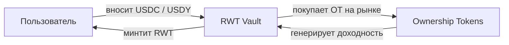

## Ключевая идея

**RWT — это основной утилитарный токен протокола Areal**, созданный для решения фундаментальной проблемы фрагментированной ликвидности на рынке RWA.

Вместо распределения капитала по десяткам изолированных пулов, Areal агрегирует доходность от множества реальных активов в одном токене. RWT накапливает диверсифицированную RWA-доходность через <Tooltip tip="Ownership Token — токенизированное представление конкретного реального актива в протоколе Areal">Ownership Tokens</Tooltip>, хранящиеся в его хранилище (vault), становясь единой точкой доступа ко всему портфелю протокола.

<Info>
  RWT **не представляет собой владение**, **не даёт прав на денежные потоки** и **не создаёт юридических или финансовых обязательств**. Это permissionless utility-токен, который служит единым слоем ликвидности и агрегации доходности протокола.
</Info>

<Card title="Что такое Ownership Tokens?" icon="key" href="/ru/economics/ownership-tokens">
  Токенизированные представления конкретных реальных активов в Areal
</Card>

---

## RWT Vault

**RWT Vault** — это ключевой механизм, который обеспечивает RWT реальными активами. Vault содержит диверсифицированный портфель <Tooltip tip="Ownership Token — токенизированное представление конкретного реального актива в протоколе Areal">Ownership Tokens</Tooltip> — и приобретает их на открытом рынке за счёт внесённого капитала.

### Как наполняется vault

Когда пользователи минтят RWT, они вносят **USDC** или **USDY** в vault. Vault затем использует этот капитал для **покупки Ownership Tokens на рынке** — выбирая активы, одобренные [governance](/ru/architecture/governance-and-futarchy).

<Note>
  RWA-проекты выпускают Ownership Tokens, которые свободно торгуются на рынке. RWT Vault **покупает** эти токены — проекты не депонируют их в vault напрямую. Это обеспечивает справедливое рыночное ценообразование и прозрачное размещение капитала.
</Note>

По мере накопления Ownership Tokens растёт диверсификация и потенциал доходности vault — без размывания существующих держателей RWT.

---

## Природа flatcoin — NAV Book Value

RWT — это **flatcoin**: его цена не привязана к $1, а привязана к динамически рассчитываемому **NAV Book Value**, который растёт со временем по мере накопления доходности.

**NAV Book Value** рассчитывается как:

> **NAV Book Value = (Начальный инвестированный капитал + Накопленная доходность, зачисленная в book value) / Общее количество RWT в обращении**

### Как растёт NAV Book Value

Ключевой механизм роста: **70% всей доходности**, генерируемой Ownership Tokens в vault, зачисляется в общий инвестированный капитал. Это означает, что числитель формулы непрерывно увеличивается даже без новых депозитов — толкая NAV Book Value вверх.

**Пошаговый пример:**

<Steps>
  <Step title="Стартовая точка">
    $10,000 вложено в активы vault, 10,000 RWT в обращении

    **NAV Book Value = $10,000 / 10,000 = $1.00**
  </Step>
  <Step title="Vault зарабатывает доходность">
    Ownership Tokens в vault генерируют $1,000 доходности (аренда, проценты, выручка)
  </Step>
  <Step title="70% зачисляется в book value">
    70% от $1,000 = $700 зачисляется в общий инвестированный капитал

    NAV Book Value = $10,700 / 10,000 = $1.07
  </Step>
</Steps>

Именно это делает RWT **растущим flatcoin** — он не просто сохраняет стоимость, а стабильно дорожает по мере поступления реальной доходности в vault.

### Преимущества ценообразования на базе NAV

<CardGroup cols={2}>
  <Card title="Прозрачное ценообразование" icon="eye">
    NAV Book Value детерминирован и верифицируем — всегда основан на реальном капитале vault и общем предложении
  </Card>
  <Card title="Без разводнения при минтинге" icon="shield-check">
    Новые минтеры платят текущий NAV Book Value, поэтому существующие держатели никогда не размываются
  </Card>
  <Card title="Рост через доходность" icon="chart-line">
    70% доходности непрерывно повышает ценовой пол — спекуляции не нужны
  </Card>
  <Card title="Самовозрастающий ценовой пол" icon="arrow-trend-up">
    NAV Book Value растёт по мере накопления доходности, создавая стабильно повышающуюся базовую цену
  </Card>
</CardGroup>

Ликвидность в мастер-пулах всегда сконцентрирована вокруг NAV Book Value, обеспечивая точное отслеживание рыночной ценой справедливой стоимости базовых активов.

---

## Распределение доходности

Активы в RWT Vault генерируют реальную доходность — аренда, проценты, выручка. Эта доходность распределяется по фиксированной модели аллокации:

<CardGroup cols={2}>
  <Card title="70% → Рост Book Value" icon="chart-line">
    Основная часть доходности реинвестируется в vault, напрямую увеличивая NAV Book Value и повышая цену каждого RWT.
  </Card>
  <Card title="15% → Ликвидность RWT" icon="droplet">
    Направляется на углубление ликвидности в мастер-пулах, обеспечивая эффективную торговлю с минимальным проскальзыванием.
  </Card>
  <Card title="5% → Казначейство Areal" icon="building-columns">
    Направляется в [Казначейство Areal](/ru/economics/treasury) на развитие протокола, операционные расходы и рост экосистемы.
  </Card>
  <Card title="10% → Казначейство Areal" icon="shield-check">
    Направляется в [Казначейство Areal](/ru/economics/treasury) для обеспечения безопасности протокола и устойчивости экосистемы.
  </Card>
</CardGroup>

---

## Permissionless Minting

Любой может выпустить (mint) RWT в любой момент — без вайтлистов, гейткиперов или процедур одобрения. Цена минтинга всегда равна **текущему NAV Book Value**, а не фиксированному $1 и не рыночной цене.

**Цена минтинга = текущий NAV Book Value + 1% комиссия**

При каждом минте взимается **комиссия 1%**:
- **0.5%** поступает в RWT Vault — напрямую увеличивая NAV Book Value для всех держателей
- **0.5%** поступает в [Areal DAO](/ru/economics/treasury) — на развитие протокола и операционные расходы

Например, если NAV Book Value = $1.50:
- Вы вносите **151.50 USDC** (150 + 1% комиссия)
- Получаете **100 RWT**
- $0.75 идёт в vault (растит NAV), $0.75 идёт в Areal DAO

<Info>
  Permissionless minting создаёт **нулевое разводнение** — каждый новый минтер платит точную справедливую стоимость за свою долю в vault. Существующие держатели никогда не оказываются в невыгодном положении из-за новых минтов.
</Info>

---

## Мастер-пулы ликвидности

RWT имеет два мастер-пула ликвидности на [нативном DEX](/ru/architecture/liquidity-and-native-dex) Areal, обеспечивающих основные точки входа и выхода из экосистемы:

<CardGroup cols={2}>
  <Card title="RWT / USDY" icon="coins">
    Основной пул в паре с **USDY** — yield-bearing стейблкоином от Ondo Finance. Этот пул позволяет держателям RWT получать доходность стейблкоина, одновременно предоставляя ликвидность.
  </Card>
  <Card title="RWT / USDC" icon="dollar-sign">
    Вторичный пул в паре с **USDC** — самым распространённым стейблкоином. Обеспечивает простую точку входа для новых участников.
  </Card>
</CardGroup>

Оба пула являются **пулами концентрированной ликвидности**, с ликвидностью, сконцентрированной вокруг текущего NAV Book Value в диапазоне **50 bins**. Такая концентрация обеспечивает глубокую ликвидность именно там, где происходит торговля, максимизируя эффективность капитала.

---

## Автоматическая ребалансировка

Для поддержания ликвидности в соответствии с текущей справедливой ценой протокол реализует **автоматическую ребалансировку** мастер-пулов.

Когда текущий NAV Book Value отклоняется от предыдущего NAV Book Value более чем на **1%**, запускается автоматическая ребалансировка:

1. Позиции ликвидности в мастер-пулах выводятся
2. Рассчитывается новый NAV Book Value на основе обновлённой стоимости активов vault
3. Ликвидность перераспределяется и формируется заново вокруг нового NAV Book Value
4. Концентрированный диапазон из 50 bins центрируется на обновлённой цене

<Note>
  Этот механизм обеспечивает **постоянную концентрацию ликвидности вокруг справедливой цены** RWT, предотвращая устаревание позиций ликвидности и поддерживая эффективные рынки вне зависимости от изменений NAV Book Value.
</Note>

---

## Агентное управление

Areal проектирует архитектуру RWT Vault с расчётом на **будущее автономное управление AI-финансовыми агентами**. Цель: полностью автономный vault, максимизирующий доходность при сохранении диверсификации и контроля рисков.

Агенты будут отвечать за:
- **Стратегию накопления** — выбор Ownership Tokens для включения в vault
- **Оптимизацию распределения доходности** — динамическую настройку параметров аллокации
- **Тайминг извлечения прибыли** — определение оптимальных моментов для фиксации доходов
- **Параметры ребалансировки** — тонкую настройку диапазонов концентрации и порогов ребалансировки

<Info>
  Агентное управление сейчас **в разработке**. На данный момент эти параметры контролируются через [governance](/ru/architecture/governance-and-futarchy). Переход к управлению через AI будет постепенным и управляемым сообществом.
</Info>

---

## Резюме

<CardGroup cols={3}>
  <Card title="Токен, обеспеченный vault" icon="vault" color="#a56eff">
    RWT обеспечен диверсифицированным vault из Ownership Tokens, представляющих реальные активы
  </Card>
  <Card title="Прозрачная модель доходности" icon="chart-mixed" color="#a56eff">
    70% на рост Book Value, 15% на ликвидность, 10% в резервы, 5% в казначейство
  </Card>
  <Card title="Ценообразование по NAV Book Value" icon="calculator" color="#a56eff">
    Цена привязана к справедливой стоимости: общие активы vault делённые на общее количество RWT
  </Card>
  <Card title="Автоматическая ребалансировка" icon="arrows-rotate" color="#a56eff">
    Мастер-пулы автоматически ребалансируются при отклонении NAV Book Value более чем на 1%
  </Card>
  <Card title="Permissionless minting" icon="unlock" color="#a56eff">
    Любой может минтить RWT по цене NAV Book Value — без гейткиперов и одобрений
  </Card>
  <Card title="Agentic-ready" icon="robot" color="#a56eff">
    Архитектура vault спроектирована для будущего автономного управления AI-агентами
  </Card>
</CardGroup>
