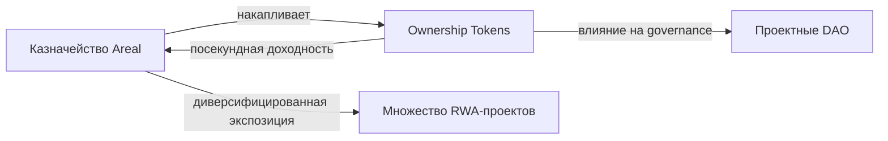

## Ключевая идея

**Казначейство Areal DAO — это активно управляемый капитал протокола**, созданный для максимизации прибыли держателей [ARL](/ru/economics/arl-protocol-token).

Казначейство — это не пассивное хранилище и не расходный счёт. Это **стратегический двигатель роста** — аккумулирующий доход из множества источников протокола, предоставляющий ликвидность по всей экосистеме, выстраивающий стратегические позиции в Ownership Tokens и генерирующий дополнительную доходность от всех этих активностей.

Каждый доллар в казначействе работает — зарабатывает комиссии, наращивает доходность и укрепляет экономический фундамент протокола.

<Info>
  Казначейство управляется держателями ARL через [футархию](/ru/architecture/governance-and-futarchy). Все решения по аллокации, изменения стратегии и размещения капитала оцениваются по ожидаемым результатам — а не голосами комитетов.
</Info>

---

## Источники дохода

Areal DAO генерирует доход из четырёх различных источников. Вместе они создают диверсифицированную базу дохода, которая растёт вместе с экосистемой:

<CardGroup cols={2}>
  <Card title="Комиссии нативного DEX" icon="arrow-right-arrow-left">
    **0.25% от каждого свопа** на [нативном DEX](/ru/architecture/liquidity-and-native-dex) поступает напрямую в казначейство — со всех типов пулов, всех пар. Это 50% от базовой swap-комиссии 0.5%, всегда выплачиваемой в RWT.
  </Card>
  <Card title="Казначейская комиссия OT" icon="vault">
    **Дополнительная комиссия 0.5%** на все свопы OT-пар — направляется в резервы OT-проектов под управлением [governance на основе футархии](/ru/architecture/governance-and-futarchy). Общая комиссия OT-пар: 1%.
  </Card>
  <Card title="RWT Engine" icon="coins">
    Два потока дохода от [RWT](/ru/economics/rwt-real-world-token): **0.5% от каждого минта RWT** (половина от 1% комиссии за минт) плюс **15% от всей доходности** активов в RWT Vault.
  </Card>
  <Card title="Контракт распределения доходности" icon="chart-line">
    Комиссия **0.25%** с каждого [распределения доходности](/ru/architecture/yield-and-reward-distribution), обработанного через протокол — взимается при поступлении средств в контракт распределения.
  </Card>
  <Card title="Награды Nexus LP" icon="droplet">
    Награды в виде swap-комиссий от собственных LP-позиций Areal — забираются из хранилищ комиссий пулов напрямую в казначейство через `nexus_claim_rewards`.
  </Card>
  <Card title="Операции казначейства" icon="building-columns">
    Доходность от активного управления казначейством — доходность от удерживаемых OT-токенов, доходы от стратегических позиций в активах и рост экосистемы.
  </Card>
</CardGroup>

Эти потоки дохода спроектированы для масштабирования вместе с экосистемой: больше проектов → больше OT → больше торгового объёма → больше минтинга → больше распределений доходности → больше дохода в казначейство.

---

## Накопление Ownership Tokens

Казначейство стратегически накапливает [Ownership Tokens](/ru/economics/ownership-tokens) проектов экосистемы Areal. Это не пассивное хранение — это активная инвестиционная стратегия с эффектом компаундинга.

Принцип похож на то, как [RWT Vault](/ru/economics/rwt-real-world-token) накапливает OT для обеспечения токена RWT. Но в отличие от RWT — который является исключительно инструментом агрегации доходности — держатели ARL также владеют **интеллектуальной собственностью протокола**, продуктами, инфраструктурой и всеми экономическими потоками. Портфель OT в казначействе — лишь один компонент более широкой базы активов Areal DAO.

Ещё одно ключевое отличие: ARL торгуется на [нативном DEX](/ru/architecture/liquidity-and-native-dex) в **стандартном пуле ликвидности** (constant-product), а не в концентрированном NAV-привязанном пуле. Это значит, что рыночная цена ARL определяется спросом и предложением на открытом рынке — она может быть выше или ниже балансовой стоимости казначейства в любой момент времени.

### Генерация доходности

Как держатель Ownership Tokens, казначейство получает доходность как любой другой держатель — через [посекундное начисление](/ru/architecture/yield-and-reward-distribution). Выручка проектов (аренда, сборы, роялти) распределяется между держателями OT пропорционально, и позиции казначейства зарабатывают непрерывно.

### Стратегическое влияние

Владение OT даёт казначейству вес в governance проектов через [футархию](/ru/architecture/governance-and-futarchy). Это позволяет Areal DAO участвовать в ключевых решениях проектов экосистемы — выравнивая их стратегии с общим видением протокола.

### Диверсификация

Накапливая OT разных RWA-проектов, казначейство получает экспозицию к диверсифицированному портфелю реальных активов — недвижимость, инфраструктура, интеллектуальная собственность — снижая концентрационный риск и стабилизируя доход.

---

## Предоставление ликвидности — Nexus

Areal DAO — **основной провайдер ликвидности** на платформе. Капитал казначейства управляется через **Liquidity Nexus** — выделенный смарт-контракт PDA внутри [нативного DEX](/ru/contracts/native-dex), который владеет LP-позициями и токен-аккаунтами от имени протокола.

### Как работает Nexus

Nexus PDA выступает как ончейн LP-менеджер Areal Finance:

- **Капитал поступает** через `nexus_deposit` — 10% дохода от OT (USDC) и 15% доходности RWT Engine (RWT) направляются через кранки
- **Бот-менеджер** выполняет LP-операции: `nexus_swap`, `nexus_add_liquidity`, `nexus_remove_liquidity`
- **Награды LP-комиссий** забираются из хранилищ комиссий пулов напрямую в казначейство Areal через `nexus_claim_rewards`
- **Средства защищены** — бот-менеджер не может извлечь токены напрямую, только оперировать через инструкции DEX
- **Менеджер заменяем** — авторитет DEX (Team Multisig) может заменить кошелёк менеджера через `update_nexus_manager`

<Warning>
  Бот-менеджер Nexus **не имеет полномочий на вывод средств**. Он может только свопать, добавлять и удалять ликвидность в рамках DEX. Награды LP-комиссий забираются исключительно авторитетом DEX (Team Multisig) на кошелёк казначейства Areal.
</Warning>

### Ключевые позиции

<CardGroup cols={2}>
  <Card title="Мастер-пул RWT / USDY" icon="droplet">
    Односторонний Monotonic Ladder — Nexus предоставляет **только USDC** на bid-стороне. Ask-сторона органическая (от продаж пользователей) или синтетическая (mint). Основная торговая площадка RWT в паре с yield-bearing стейблкоином.
  </Card>
  <Card title="Мастер-пул RWT / USDC" icon="dollar-sign">
    Односторонний Monotonic Ladder — та же модель финансирования bid-only. Доступная точка входа в связке с самым распространённым стейблкоином.
  </Card>
  <Card title="Пулы RWT / OT" icon="link">
    Стартовая ликвидность для проектных пар на **стандартной кривой** (x × y = k) — запуск торговли для новых Ownership Tokens. OT-пары не используют ladder — OT не минтятся по book value.
  </Card>
  <Card title="Стратегические пары" icon="globe">
    Ликвидность для пар со сторонними токенами по решению governance — расширение торговой вселенной DEX
  </Card>
</CardGroup>

### Поток финансирования Nexus для мастер-пулов

Депозиты Nexus целиком идут в **bid-side USDC-бины**:

1. Поступающий капитал (15% доходности RWT Engine + 10% USDC от выручки OT) накапливается в Nexus PDA
2. На каждом вызове `grow_liquidity` менеджер черпает из аккумулятора, чтобы финансировать **новые USDC-бины**, расширяющие bid wall вправо по мере роста NAV
3. Nexus никогда не депонирует RWT в мастер-пулы — протокол полагается на mint как на ask-сторону

Это создаёт **самоусиливающийся flywheel глубины**: рост NAV → доходность → приток USDC в Nexus → более глубокая bid wall → лучшая exit-ликвидность → больше уверенности держателей → больше спроса на mint → рост NAV.

### Что зарабатывает казначейство как LP

- **Swap-комиссии LP** — 0.25% от каждой bin-path сделки, собираемые в хранилищах комиссий пулов и мгновенно забираемые через `nexus_claim_rewards`
- **Компаундинг доходности OT** (только OT-пулы) — пулы, содержащие OT-токены, получают RWT-доходность от Yield Distribution, автоматически компаундируемую в резервы через `compound_yield` — пассивно увеличивая стоимость LP-позиции
- **Yield pass-through** — базовая доходность токенов в пулах (доходность USDY в мастер-пулах; OT + USDC yield в OT-пулах)
- **Глубина экосистемы** — более глубокая bid-ликвидность привлекает больше объёма, что генерирует больше комиссий, создавая самоусиливающийся цикл

<Note>
  На **mint-пути** мастер-пула (USDC→RWT маршрутизируется в `rwt_engine::mint_rwt`, когда DEX ask неконкурентен) DEX-комиссия не взимается — LP не зарабатывают на этом потоке. Mint fee (1%) по дизайну делится 0.5% vault / 0.5% Areal DAO, что напрямую питает рост NAV и Казначейство ARL.
</Note>

Казначейство запускает ликвидность при создании новых пулов и поддерживает позиции долгосрочно — обеспечивая экосистеме постоянную достаточную глубину для эффективной торговли.

---

## Управление

Все решения по казначейству принимаются через [governance на основе футархии](/ru/architecture/governance-and-futarchy) держателями ARL. Нет комитета, нет мультисига с дискреционными полномочиями — каждое размещение капитала управляется ончейн.

Governance контролирует:

- **Аллокацию капитала** — сколько размещать в LP-позиции через Nexus, накопление OT или развитие экосистемы
- **Выбор активов** — какие Ownership Tokens накапливать, для каких пулов предоставлять ликвидность
- **Параметры рисков** — лимиты концентрации, пороги ребалансировки, конфигурация менеджера Nexus
- **Изменения стратегии** — корректировка баланса между максимизацией доходности и развитием экосистемы

Футархия гарантирует, что решения оцениваются по **ожидаемым экономическим результатам** — плохая аллокация капитала снижает стоимость ARL, сильная — увеличивает. Это создаёт встроенную ответственность за каждое действие казначейства.

---

## Инфраструктура для AI-агентов

Areal проектирует архитектуру казначейства для **будущего автономного управления специализированными AI-агентами**. Цель: максимизация доходности казначейства через непрерывную, основанную на данных оптимизацию, которая работает быстрее и точнее ручного governance.

Специализированные агенты для нужд Areal:

- **Оптимизация LP** — динамическая корректировка позиций ликвидности, диапазонов концентрации и аллокации капитала между пулами на основе паттернов объёмов и генерации комиссий
- **Стратегия накопления OT** — определение оптимальных точек входа для покупки Ownership Tokens, тайминг приобретений на основе ожидаемой доходности и рыночных условий
- **Тайминг извлечения прибыли** — определение оптимальных моментов для фиксации прибыли от LP-позиций, доходности OT и стратегических позиций
- **Ребалансировка портфеля** — поддержание целевых аллокаций между классами активов, управление концентрационным риском и реагирование на изменения рынка

<Info>
  Агентное управление находится **в разработке**. Сегодня все параметры казначейства контролируются через [governance на основе футархии](/ru/architecture/governance-and-futarchy). Переход к AI-управлению будет постепенным, управляемым сообществом и ориентированным на измеримые улучшения результатов.
</Info>

---

## Резюме

<CardGroup cols={3}>
  <Card title="Максимизация прибыли" icon="chart-line" color="#a56eff">
    Главная цель казначейства — каждое решение и аллокация ориентированы на максимизацию дохода для держателей ARL
  </Card>
  <Card title="Четыре потока дохода" icon="money-bill-trend-up" color="#a56eff">
    Swap-комиссии DEX, доход RWT Engine, комиссии распределения доходности и доходы от операций казначейства
  </Card>
  <Card title="Накопление OT" icon="coins" color="#a56eff">
    Стратегические позиции в Ownership Tokens приносят посекундную доходность, влияние на governance и диверсификацию
  </Card>
  <Card title="Основной LP" icon="droplet" color="#a56eff">
    Areal DAO запускает и поддерживает ликвидность в мастер-пулах и проектных парах, зарабатывая комиссии и углубляя рынки
  </Card>
  <Card title="Управление через футархию" icon="scale-balanced" color="#a56eff">
    Все решения — аллокация, стратегия, риски — принимаются через рыночно-ориентированное управление со встроенной ответственностью
  </Card>
  <Card title="Готовность к AI-агентам" icon="robot" color="#a56eff">
    Архитектура казначейства спроектирована для будущего автономного управления специализированными AI-агентами
  </Card>
</CardGroup>
